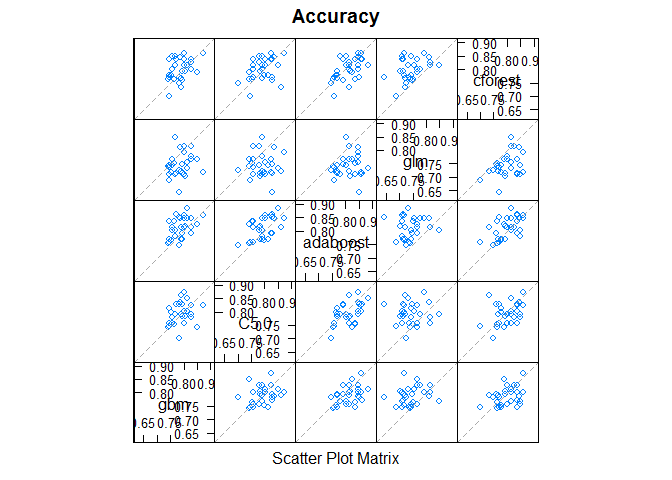

# Modeling risk of aquatic species declines
Amy Davis  
Wednesday, November 08, 2017  

I am using logistic regression and four machine learning algorithms to identify watersheds at risk of biodiversity decline  using the distributions of over 1400 freshwater threatened and non-threatened species (IUCN) and a set of ~ 100 predictors characterizing alien species distribution, habitat, climate, and landscape composition and anthropogenic stressors.


```r
#Load packages
library(caret)
library(caretEnsemble)
library(glmnet)
library(gbm)
library(C50)
library(kernlab)
library(MASS)
library(pROC)
library(party)
library(fastAdaboost)
```


```r
#Read in data
natdata <- read.csv("M:/Net MyDocuments/Projects/EPA_Invasives/nativeDiv_modeling/NativeModeling/natchange1a.csv")
natdata1<-na.omit(natdata)
##Change response to factor (categorical variable)
natdata1$presdecl<-as.factor(natdata1$presdecl)
levels(natdata1$presdecl)<-list(notdeclining1="0",declining1="1") 
```


```r
#Divide data into training (70% of original) and testing (30% of original) sets

set.seed(457)
natdatasample <- sample.int(n = nrow(natdata1), size = floor(.70*nrow(natdata1)), replace = F)
nattrain <- natdata1[natdatasample, ] #n=851
nattest  <- natdata1[-natdatasample, ]#n=366
nrow(nattrain)
```

```
## [1] 861
```

```r
nrow(nattest)
```

```
## [1] 370
```


```r
#these predictors are the result from findLinearCombos (need to add this code back in). These predictors are linear combos of other predictors in the models and thus need to be removed
nattrain_fix<-within(nattrain, rm("xcoor","yccor","HUC2","tdoxnT_8","tdrednT_8","tdnt_8","tdst_8","rich_both"))
nattest_fix<-within(nattest, rm("xcoor","yccor","HUC2","tdoxnT_8","tdrednT_8","tdnt_8","tdst_8","rich_both"))

names(nattrain_fix)
```

```
##  [1] "HUC8.x"              "xHUC8"               "presdecl"           
##  [4] "plantER"             "TOT_SPRICH"          "logArea"            
##  [7] "logffsum_sqK"        "logpopdens_sqK"      "logAqHab_sqK"       
## [10] "huc8_preci"          "logportdist"         "maxTmp"             
## [13] "awdoxnT_8"           "awd_rednT_8"         "awdST_8"            
## [16] "ddoxnT_8"            "ddrednT_8"           "ddst_8"             
## [19] "StrDens"             "WaterbodyA"          "TotalLength"        
## [22] "BiotaImpLe"          "MercuryImp"          "MetalsImpL"         
## [25] "NuisanceIm"          "NutImpLen"           "OrgEnrO2De"         
## [28] "PathogenIm"          "Pesticides"          "pHImpLen"           
## [31] "SedTurbImp"          "TempImpLen"          "OtherImpLe"         
## [34] "TotImpLen"           "TD_N_T"              "TD_S_T"             
## [37] "strlak15p"           "strlak5p"            "ManureMean"         
## [40] "WET_AG"              "PAGHYD80"            "WET_URB"            
## [43] "PIMPV"               "SNFA_MEAN"           "NIDamMGAL"          
## [46] "PWETL"               "PDEV"                "PAGC"               
## [49] "CanalDens"           "DamDens"             "DamNIDDens"         
## [52] "DamNRMDens"          "NPDESDens"           "SuperfundDens"      
## [55] "TRIDens"             "NPDESRipBufDens"     "SuperfundRipBufDens"
## [58] "TRIRipBufDens"       "MineDens"            "MinesRipBufDens"    
## [61] "PestiDens"           "RdDens"              "RdRipBufDens"       
## [64] "RdCrsDens"           "Runoff"              "cuminvportdist"     
## [67] "cuminvportdist.1"    "CIP_both.x"          "CIP_anim"           
## [70] "rich_anim"           "CIP_plant"           "AB_water"           
## [73] "AB_devel"            "AB_forest"           "AB_wetland"         
## [76] "AB_allnat"           "BC_water"            "BC_devel"           
## [79] "BC_forest"           "BC_wetland"          "BC_allnat"          
## [82] "CD_water"            "CD_devel"            "CD_forest"          
## [85] "CD_allnat"           "DE_water"            "DE_devel"           
## [88] "DE_forest"           "DE_wetland"          "DE_allnat"
```


```r
#remove the first 2 variables, which are watershed ID variables
nattrain_fix1<-nattrain_fix[3:90]
```


Finally, we get to the good stuff: we are ready to build and run a stack of models using the Caret package

```r
#The control function below specifies 10 fold cross validation, repeated 3 times
control <- trainControl(method="repeatedcv", number=10, repeats=3, savePredictions="final", classProbs=TRUE,preProc=c("center","scale"))
classList1 <- c("gbm","C5.0","adaboost","glm","cforest")
set.seed(457)
model_list1 <- caretList(
presdecl~., data=nattrain_fix1,
trControl=control,
methodList=classList1
)
```

```
## Iter   TrainDeviance   ValidDeviance   StepSize   Improve
##      1        1.3456             nan     0.1000    0.0144
##      2        1.3205             nan     0.1000    0.0120
##      3        1.3004             nan     0.1000    0.0095
##      4        1.2765             nan     0.1000    0.0116
##      5        1.2563             nan     0.1000    0.0076
##      6        1.2384             nan     0.1000    0.0074
##      7        1.2197             nan     0.1000    0.0063
##      8        1.2021             nan     0.1000    0.0077
##      9        1.1891             nan     0.1000    0.0064
##     10        1.1747             nan     0.1000    0.0051
##     20        1.0767             nan     0.1000    0.0025
##     40        0.9477             nan     0.1000    0.0011
##     60        0.8776             nan     0.1000    0.0005
##     80        0.8266             nan     0.1000    0.0002
##    100        0.7880             nan     0.1000    0.0001
##    120        0.7552             nan     0.1000   -0.0003
##    140        0.7251             nan     0.1000   -0.0008
##    150        0.7110             nan     0.1000   -0.0010
## 
## Iter   TrainDeviance   ValidDeviance   StepSize   Improve
##      1        1.3315             nan     0.1000    0.0222
##      2        1.2939             nan     0.1000    0.0166
##      3        1.2560             nan     0.1000    0.0172
##      4        1.2263             nan     0.1000    0.0118
##      5        1.1939             nan     0.1000    0.0160
##      6        1.1680             nan     0.1000    0.0113
##      7        1.1451             nan     0.1000    0.0105
##      8        1.1182             nan     0.1000    0.0102
##      9        1.0981             nan     0.1000    0.0072
##     10        1.0816             nan     0.1000    0.0073
##     20        0.9383             nan     0.1000    0.0037
##     40        0.8073             nan     0.1000   -0.0017
##     60        0.7237             nan     0.1000   -0.0012
##     80        0.6671             nan     0.1000   -0.0007
##    100        0.6189             nan     0.1000   -0.0017
##    120        0.5746             nan     0.1000    0.0003
##    140        0.5351             nan     0.1000   -0.0005
##    150        0.5159             nan     0.1000    0.0005
## 
## Iter   TrainDeviance   ValidDeviance   StepSize   Improve
##      1        1.3206             nan     0.1000    0.0278
##      2        1.2662             nan     0.1000    0.0239
##      3        1.2216             nan     0.1000    0.0207
##      4        1.1853             nan     0.1000    0.0145
##      5        1.1507             nan     0.1000    0.0141
##      6        1.1208             nan     0.1000    0.0095
##      7        1.0930             nan     0.1000    0.0110
##      8        1.0638             nan     0.1000    0.0102
##      9        1.0427             nan     0.1000    0.0082
##     10        1.0167             nan     0.1000    0.0111
##     20        0.8668             nan     0.1000    0.0033
##     40        0.7122             nan     0.1000   -0.0010
##     60        0.6194             nan     0.1000   -0.0002
##     80        0.5501             nan     0.1000   -0.0013
##    100        0.4895             nan     0.1000   -0.0006
##    120        0.4440             nan     0.1000   -0.0011
##    140        0.4012             nan     0.1000   -0.0011
##    150        0.3786             nan     0.1000   -0.0004
## 
## Iter   TrainDeviance   ValidDeviance   StepSize   Improve
##      1        1.3523             nan     0.1000    0.0147
##      2        1.3262             nan     0.1000    0.0113
##      3        1.3014             nan     0.1000    0.0109
##      4        1.2832             nan     0.1000    0.0077
##      5        1.2650             nan     0.1000    0.0064
##      6        1.2490             nan     0.1000    0.0072
##      7        1.2348             nan     0.1000    0.0069
##      8        1.2226             nan     0.1000    0.0033
##      9        1.2099             nan     0.1000    0.0031
##     10        1.1902             nan     0.1000    0.0073
##     20        1.0837             nan     0.1000    0.0028
##     40        0.9578             nan     0.1000    0.0017
##     60        0.8871             nan     0.1000    0.0007
##     80        0.8393             nan     0.1000    0.0005
##    100        0.7988             nan     0.1000   -0.0004
##    120        0.7621             nan     0.1000   -0.0003
##    140        0.7382             nan     0.1000   -0.0001
##    150        0.7271             nan     0.1000   -0.0007
## 
## Iter   TrainDeviance   ValidDeviance   StepSize   Improve
##      1        1.3304             nan     0.1000    0.0215
##      2        1.2875             nan     0.1000    0.0186
##      3        1.2523             nan     0.1000    0.0156
##      4        1.2205             nan     0.1000    0.0147
##      5        1.1919             nan     0.1000    0.0100
##      6        1.1768             nan     0.1000    0.0038
##      7        1.1554             nan     0.1000    0.0072
##      8        1.1321             nan     0.1000    0.0093
##      9        1.1116             nan     0.1000    0.0074
##     10        1.0933             nan     0.1000    0.0057
##     20        0.9539             nan     0.1000    0.0036
##     40        0.8110             nan     0.1000    0.0010
##     60        0.7365             nan     0.1000   -0.0014
##     80        0.6740             nan     0.1000    0.0004
##    100        0.6288             nan     0.1000   -0.0012
##    120        0.5854             nan     0.1000   -0.0016
##    140        0.5490             nan     0.1000   -0.0010
##    150        0.5308             nan     0.1000   -0.0008
## 
## Iter   TrainDeviance   ValidDeviance   StepSize   Improve
##      1        1.3187             nan     0.1000    0.0286
##      2        1.2737             nan     0.1000    0.0201
##      3        1.2316             nan     0.1000    0.0191
##      4        1.1954             nan     0.1000    0.0141
##      5        1.1663             nan     0.1000    0.0098
##      6        1.1350             nan     0.1000    0.0111
##      7        1.1080             nan     0.1000    0.0108
##      8        1.0803             nan     0.1000    0.0112
##      9        1.0599             nan     0.1000    0.0076
##     10        1.0414             nan     0.1000    0.0050
##     20        0.8906             nan     0.1000    0.0023
##     40        0.7386             nan     0.1000   -0.0003
##     60        0.6431             nan     0.1000   -0.0004
##     80        0.5697             nan     0.1000    0.0001
##    100        0.5115             nan     0.1000   -0.0000
##    120        0.4673             nan     0.1000   -0.0003
##    140        0.4227             nan     0.1000   -0.0010
##    150        0.4042             nan     0.1000   -0.0014
## 
## Iter   TrainDeviance   ValidDeviance   StepSize   Improve
##      1        1.3461             nan     0.1000    0.0167
##      2        1.3236             nan     0.1000    0.0079
##      3        1.2983             nan     0.1000    0.0126
##      4        1.2760             nan     0.1000    0.0085
##      5        1.2550             nan     0.1000    0.0109
##      6        1.2364             nan     0.1000    0.0085
##      7        1.2201             nan     0.1000    0.0074
##      8        1.2042             nan     0.1000    0.0061
##      9        1.1909             nan     0.1000    0.0057
##     10        1.1760             nan     0.1000    0.0033
##     20        1.0725             nan     0.1000    0.0039
##     40        0.9509             nan     0.1000    0.0016
##     60        0.8858             nan     0.1000   -0.0017
##     80        0.8370             nan     0.1000   -0.0002
##    100        0.8006             nan     0.1000   -0.0002
##    120        0.7691             nan     0.1000   -0.0001
##    140        0.7424             nan     0.1000   -0.0003
##    150        0.7315             nan     0.1000   -0.0010
## 
## Iter   TrainDeviance   ValidDeviance   StepSize   Improve
##      1        1.3323             nan     0.1000    0.0196
##      2        1.2844             nan     0.1000    0.0219
##      3        1.2487             nan     0.1000    0.0166
##      4        1.2229             nan     0.1000    0.0116
##      5        1.1937             nan     0.1000    0.0144
##      6        1.1711             nan     0.1000    0.0083
##      7        1.1451             nan     0.1000    0.0101
##      8        1.1233             nan     0.1000    0.0089
##      9        1.1036             nan     0.1000    0.0053
##     10        1.0864             nan     0.1000    0.0067
##     20        0.9496             nan     0.1000    0.0044
##     40        0.8128             nan     0.1000   -0.0015
##     60        0.7353             nan     0.1000    0.0003
##     80        0.6763             nan     0.1000   -0.0009
##    100        0.6244             nan     0.1000   -0.0010
##    120        0.5850             nan     0.1000   -0.0002
##    140        0.5458             nan     0.1000   -0.0001
##    150        0.5304             nan     0.1000   -0.0011
## 
## Iter   TrainDeviance   ValidDeviance   StepSize   Improve
##      1        1.3213             nan     0.1000    0.0263
##      2        1.2669             nan     0.1000    0.0258
##      3        1.2251             nan     0.1000    0.0175
##      4        1.1801             nan     0.1000    0.0201
##      5        1.1409             nan     0.1000    0.0159
##      6        1.1079             nan     0.1000    0.0140
##      7        1.0844             nan     0.1000    0.0087
##      8        1.0618             nan     0.1000    0.0053
##      9        1.0351             nan     0.1000    0.0113
##     10        1.0137             nan     0.1000    0.0067
##     20        0.8652             nan     0.1000    0.0062
##     40        0.7261             nan     0.1000   -0.0014
##     60        0.6334             nan     0.1000    0.0008
##     80        0.5669             nan     0.1000   -0.0013
##    100        0.5085             nan     0.1000   -0.0005
##    120        0.4616             nan     0.1000   -0.0008
##    140        0.4228             nan     0.1000   -0.0012
##    150        0.4062             nan     0.1000   -0.0010
## 
## Iter   TrainDeviance   ValidDeviance   StepSize   Improve
##      1        1.3506             nan     0.1000    0.0122
##      2        1.3298             nan     0.1000    0.0070
##      3        1.3100             nan     0.1000    0.0070
##      4        1.2911             nan     0.1000    0.0074
##      5        1.2761             nan     0.1000    0.0029
##      6        1.2591             nan     0.1000    0.0071
##      7        1.2391             nan     0.1000    0.0099
##      8        1.2246             nan     0.1000    0.0059
##      9        1.2082             nan     0.1000    0.0082
##     10        1.1930             nan     0.1000    0.0067
##     20        1.0926             nan     0.1000    0.0010
##     40        0.9590             nan     0.1000    0.0013
##     60        0.8882             nan     0.1000    0.0013
##     80        0.8398             nan     0.1000   -0.0007
##    100        0.7997             nan     0.1000   -0.0007
##    120        0.7681             nan     0.1000   -0.0004
##    140        0.7438             nan     0.1000   -0.0011
##    150        0.7297             nan     0.1000    0.0003
## 
## Iter   TrainDeviance   ValidDeviance   StepSize   Improve
##      1        1.3365             nan     0.1000    0.0188
##      2        1.2972             nan     0.1000    0.0159
##      3        1.2653             nan     0.1000    0.0125
##      4        1.2356             nan     0.1000    0.0136
##      5        1.2118             nan     0.1000    0.0086
##      6        1.1881             nan     0.1000    0.0095
##      7        1.1655             nan     0.1000    0.0096
##      8        1.1404             nan     0.1000    0.0089
##      9        1.1203             nan     0.1000    0.0082
##     10        1.1051             nan     0.1000    0.0048
##     20        0.9680             nan     0.1000    0.0035
##     40        0.8279             nan     0.1000   -0.0012
##     60        0.7449             nan     0.1000   -0.0007
##     80        0.6881             nan     0.1000   -0.0003
##    100        0.6347             nan     0.1000    0.0015
##    120        0.5859             nan     0.1000   -0.0009
##    140        0.5524             nan     0.1000   -0.0009
##    150        0.5379             nan     0.1000   -0.0012
## 
## Iter   TrainDeviance   ValidDeviance   StepSize   Improve
##      1        1.3278             nan     0.1000    0.0194
##      2        1.2798             nan     0.1000    0.0212
##      3        1.2335             nan     0.1000    0.0203
##      4        1.1926             nan     0.1000    0.0174
##      5        1.1609             nan     0.1000    0.0143
##      6        1.1296             nan     0.1000    0.0124
##      7        1.1026             nan     0.1000    0.0122
##      8        1.0791             nan     0.1000    0.0087
##      9        1.0606             nan     0.1000    0.0059
##     10        1.0378             nan     0.1000    0.0093
##     20        0.8834             nan     0.1000    0.0035
##     40        0.7248             nan     0.1000   -0.0012
##     60        0.6357             nan     0.1000   -0.0007
##     80        0.5661             nan     0.1000   -0.0011
##    100        0.5157             nan     0.1000   -0.0022
##    120        0.4603             nan     0.1000   -0.0007
##    140        0.4187             nan     0.1000   -0.0007
##    150        0.4003             nan     0.1000   -0.0007
## 
## Iter   TrainDeviance   ValidDeviance   StepSize   Improve
##      1        1.3480             nan     0.1000    0.0164
##      2        1.3249             nan     0.1000    0.0110
##      3        1.3025             nan     0.1000    0.0111
##      4        1.2821             nan     0.1000    0.0074
##      5        1.2611             nan     0.1000    0.0075
##      6        1.2440             nan     0.1000    0.0067
##      7        1.2266             nan     0.1000    0.0075
##      8        1.2104             nan     0.1000    0.0066
##      9        1.1998             nan     0.1000    0.0031
##     10        1.1876             nan     0.1000    0.0044
##     20        1.0843             nan     0.1000    0.0034
##     40        0.9675             nan     0.1000    0.0009
##     60        0.9013             nan     0.1000   -0.0004
##     80        0.8502             nan     0.1000   -0.0007
##    100        0.8140             nan     0.1000   -0.0004
##    120        0.7825             nan     0.1000   -0.0001
##    140        0.7516             nan     0.1000   -0.0006
##    150        0.7407             nan     0.1000   -0.0007
## 
## Iter   TrainDeviance   ValidDeviance   StepSize   Improve
##      1        1.3414             nan     0.1000    0.0157
##      2        1.3035             nan     0.1000    0.0175
##      3        1.2683             nan     0.1000    0.0148
##      4        1.2347             nan     0.1000    0.0149
##      5        1.2057             nan     0.1000    0.0112
##      6        1.1836             nan     0.1000    0.0088
##      7        1.1689             nan     0.1000    0.0027
##      8        1.1461             nan     0.1000    0.0092
##      9        1.1238             nan     0.1000    0.0105
##     10        1.1041             nan     0.1000    0.0072
##     20        0.9681             nan     0.1000    0.0019
##     40        0.8355             nan     0.1000    0.0004
##     60        0.7523             nan     0.1000   -0.0003
##     80        0.6821             nan     0.1000   -0.0015
##    100        0.6338             nan     0.1000   -0.0011
##    120        0.5906             nan     0.1000   -0.0014
##    140        0.5475             nan     0.1000   -0.0007
##    150        0.5291             nan     0.1000   -0.0007
## 
## Iter   TrainDeviance   ValidDeviance   StepSize   Improve
##      1        1.3172             nan     0.1000    0.0284
##      2        1.2750             nan     0.1000    0.0194
##      3        1.2376             nan     0.1000    0.0179
##      4        1.1990             nan     0.1000    0.0180
##      5        1.1661             nan     0.1000    0.0117
##      6        1.1398             nan     0.1000    0.0080
##      7        1.1128             nan     0.1000    0.0087
##      8        1.0860             nan     0.1000    0.0079
##      9        1.0674             nan     0.1000    0.0062
##     10        1.0497             nan     0.1000    0.0061
##     20        0.8906             nan     0.1000    0.0026
##     40        0.7353             nan     0.1000   -0.0009
##     60        0.6423             nan     0.1000    0.0004
##     80        0.5708             nan     0.1000   -0.0005
##    100        0.5154             nan     0.1000   -0.0016
##    120        0.4702             nan     0.1000   -0.0011
##    140        0.4254             nan     0.1000   -0.0014
##    150        0.4088             nan     0.1000   -0.0008
## 
## Iter   TrainDeviance   ValidDeviance   StepSize   Improve
##      1        1.3475             nan     0.1000    0.0165
##      2        1.3191             nan     0.1000    0.0130
##      3        1.2960             nan     0.1000    0.0100
##      4        1.2742             nan     0.1000    0.0102
##      5        1.2566             nan     0.1000    0.0076
##      6        1.2416             nan     0.1000    0.0057
##      7        1.2254             nan     0.1000    0.0082
##      8        1.2082             nan     0.1000    0.0085
##      9        1.1911             nan     0.1000    0.0061
##     10        1.1766             nan     0.1000    0.0065
##     20        1.0733             nan     0.1000    0.0034
##     40        0.9525             nan     0.1000    0.0004
##     60        0.8892             nan     0.1000    0.0006
##     80        0.8428             nan     0.1000   -0.0003
##    100        0.8090             nan     0.1000   -0.0011
##    120        0.7739             nan     0.1000   -0.0000
##    140        0.7507             nan     0.1000   -0.0004
##    150        0.7405             nan     0.1000   -0.0008
## 
## Iter   TrainDeviance   ValidDeviance   StepSize   Improve
##      1        1.3301             nan     0.1000    0.0255
##      2        1.2899             nan     0.1000    0.0191
##      3        1.2532             nan     0.1000    0.0184
##      4        1.2287             nan     0.1000    0.0083
##      5        1.2033             nan     0.1000    0.0119
##      6        1.1748             nan     0.1000    0.0109
##      7        1.1491             nan     0.1000    0.0118
##      8        1.1256             nan     0.1000    0.0094
##      9        1.1085             nan     0.1000    0.0066
##     10        1.0919             nan     0.1000    0.0076
##     20        0.9534             nan     0.1000    0.0025
##     40        0.8267             nan     0.1000    0.0002
##     60        0.7463             nan     0.1000   -0.0013
##     80        0.6944             nan     0.1000   -0.0007
##    100        0.6429             nan     0.1000   -0.0007
##    120        0.5988             nan     0.1000   -0.0013
##    140        0.5559             nan     0.1000   -0.0009
##    150        0.5381             nan     0.1000   -0.0011
## 
## Iter   TrainDeviance   ValidDeviance   StepSize   Improve
##      1        1.3265             nan     0.1000    0.0210
##      2        1.2812             nan     0.1000    0.0203
##      3        1.2338             nan     0.1000    0.0231
##      4        1.1931             nan     0.1000    0.0188
##      5        1.1579             nan     0.1000    0.0142
##      6        1.1319             nan     0.1000    0.0088
##      7        1.1057             nan     0.1000    0.0085
##      8        1.0826             nan     0.1000    0.0083
##      9        1.0613             nan     0.1000    0.0068
##     10        1.0382             nan     0.1000    0.0086
##     20        0.8827             nan     0.1000    0.0019
##     40        0.7374             nan     0.1000   -0.0003
##     60        0.6515             nan     0.1000   -0.0012
##     80        0.5821             nan     0.1000   -0.0010
##    100        0.5260             nan     0.1000   -0.0006
##    120        0.4781             nan     0.1000   -0.0002
##    140        0.4287             nan     0.1000   -0.0001
##    150        0.4099             nan     0.1000   -0.0015
## 
## Iter   TrainDeviance   ValidDeviance   StepSize   Improve
##      1        1.3490             nan     0.1000    0.0137
##      2        1.3288             nan     0.1000    0.0070
##      3        1.3041             nan     0.1000    0.0122
##      4        1.2890             nan     0.1000    0.0054
##      5        1.2688             nan     0.1000    0.0085
##      6        1.2520             nan     0.1000    0.0090
##      7        1.2342             nan     0.1000    0.0070
##      8        1.2205             nan     0.1000    0.0038
##      9        1.2047             nan     0.1000    0.0071
##     10        1.1901             nan     0.1000    0.0055
##     20        1.0803             nan     0.1000    0.0036
##     40        0.9658             nan     0.1000    0.0023
##     60        0.8962             nan     0.1000   -0.0003
##     80        0.8485             nan     0.1000    0.0005
##    100        0.8121             nan     0.1000   -0.0002
##    120        0.7789             nan     0.1000   -0.0003
##    140        0.7486             nan     0.1000    0.0002
##    150        0.7353             nan     0.1000   -0.0012
## 
## Iter   TrainDeviance   ValidDeviance   StepSize   Improve
##      1        1.3366             nan     0.1000    0.0208
##      2        1.2936             nan     0.1000    0.0222
##      3        1.2637             nan     0.1000    0.0118
##      4        1.2329             nan     0.1000    0.0115
##      5        1.2022             nan     0.1000    0.0132
##      6        1.1818             nan     0.1000    0.0074
##      7        1.1617             nan     0.1000    0.0063
##      8        1.1356             nan     0.1000    0.0121
##      9        1.1125             nan     0.1000    0.0083
##     10        1.0960             nan     0.1000    0.0063
##     20        0.9698             nan     0.1000    0.0013
##     40        0.8298             nan     0.1000    0.0024
##     60        0.7508             nan     0.1000   -0.0008
##     80        0.6912             nan     0.1000    0.0001
##    100        0.6411             nan     0.1000   -0.0007
##    120        0.5904             nan     0.1000    0.0006
##    140        0.5567             nan     0.1000   -0.0009
##    150        0.5373             nan     0.1000   -0.0005
## 
## Iter   TrainDeviance   ValidDeviance   StepSize   Improve
##      1        1.3183             nan     0.1000    0.0290
##      2        1.2778             nan     0.1000    0.0156
##      3        1.2340             nan     0.1000    0.0208
##      4        1.1964             nan     0.1000    0.0175
##      5        1.1621             nan     0.1000    0.0146
##      6        1.1359             nan     0.1000    0.0091
##      7        1.1075             nan     0.1000    0.0116
##      8        1.0799             nan     0.1000    0.0108
##      9        1.0571             nan     0.1000    0.0075
##     10        1.0373             nan     0.1000    0.0066
##     20        0.8849             nan     0.1000    0.0000
##     40        0.7479             nan     0.1000   -0.0027
##     60        0.6594             nan     0.1000   -0.0012
##     80        0.5935             nan     0.1000   -0.0018
##    100        0.5396             nan     0.1000   -0.0017
##    120        0.4900             nan     0.1000   -0.0002
##    140        0.4468             nan     0.1000   -0.0010
##    150        0.4230             nan     0.1000   -0.0012
## 
## Iter   TrainDeviance   ValidDeviance   StepSize   Improve
##      1        1.3508             nan     0.1000    0.0165
##      2        1.3240             nan     0.1000    0.0125
##      3        1.3009             nan     0.1000    0.0108
##      4        1.2824             nan     0.1000    0.0080
##      5        1.2609             nan     0.1000    0.0094
##      6        1.2446             nan     0.1000    0.0076
##      7        1.2293             nan     0.1000    0.0074
##      8        1.2150             nan     0.1000    0.0065
##      9        1.1989             nan     0.1000    0.0071
##     10        1.1871             nan     0.1000    0.0044
##     20        1.0857             nan     0.1000    0.0022
##     40        0.9645             nan     0.1000   -0.0007
##     60        0.8955             nan     0.1000   -0.0006
##     80        0.8482             nan     0.1000   -0.0003
##    100        0.8078             nan     0.1000   -0.0002
##    120        0.7775             nan     0.1000   -0.0001
##    140        0.7443             nan     0.1000   -0.0001
##    150        0.7343             nan     0.1000   -0.0006
## 
## Iter   TrainDeviance   ValidDeviance   StepSize   Improve
##      1        1.3319             nan     0.1000    0.0218
##      2        1.2897             nan     0.1000    0.0188
##      3        1.2561             nan     0.1000    0.0137
##      4        1.2279             nan     0.1000    0.0102
##      5        1.1986             nan     0.1000    0.0131
##      6        1.1724             nan     0.1000    0.0114
##      7        1.1526             nan     0.1000    0.0069
##      8        1.1372             nan     0.1000    0.0037
##      9        1.1159             nan     0.1000    0.0076
##     10        1.0962             nan     0.1000    0.0089
##     20        0.9548             nan     0.1000    0.0039
##     40        0.8180             nan     0.1000    0.0012
##     60        0.7451             nan     0.1000   -0.0020
##     80        0.6805             nan     0.1000   -0.0014
##    100        0.6363             nan     0.1000   -0.0012
##    120        0.5875             nan     0.1000   -0.0017
##    140        0.5467             nan     0.1000   -0.0014
##    150        0.5309             nan     0.1000   -0.0000
## 
## Iter   TrainDeviance   ValidDeviance   StepSize   Improve
##      1        1.3210             nan     0.1000    0.0240
##      2        1.2615             nan     0.1000    0.0255
##      3        1.2180             nan     0.1000    0.0185
##      4        1.1809             nan     0.1000    0.0154
##      5        1.1445             nan     0.1000    0.0163
##      6        1.1106             nan     0.1000    0.0136
##      7        1.0825             nan     0.1000    0.0122
##      8        1.0639             nan     0.1000    0.0056
##      9        1.0400             nan     0.1000    0.0085
##     10        1.0180             nan     0.1000    0.0075
##     20        0.8660             nan     0.1000    0.0009
##     40        0.7206             nan     0.1000    0.0006
##     60        0.6262             nan     0.1000   -0.0001
##     80        0.5554             nan     0.1000   -0.0010
##    100        0.4979             nan     0.1000   -0.0003
##    120        0.4534             nan     0.1000   -0.0011
##    140        0.4143             nan     0.1000   -0.0010
##    150        0.3923             nan     0.1000   -0.0004
## 
## Iter   TrainDeviance   ValidDeviance   StepSize   Improve
##      1        1.3450             nan     0.1000    0.0181
##      2        1.3157             nan     0.1000    0.0122
##      3        1.2943             nan     0.1000    0.0095
##      4        1.2715             nan     0.1000    0.0088
##      5        1.2565             nan     0.1000    0.0048
##      6        1.2374             nan     0.1000    0.0071
##      7        1.2250             nan     0.1000    0.0044
##      8        1.2121             nan     0.1000    0.0045
##      9        1.1973             nan     0.1000    0.0061
##     10        1.1818             nan     0.1000    0.0081
##     20        1.0815             nan     0.1000    0.0025
##     40        0.9548             nan     0.1000    0.0011
##     60        0.8932             nan     0.1000    0.0001
##     80        0.8462             nan     0.1000    0.0006
##    100        0.8081             nan     0.1000   -0.0007
##    120        0.7781             nan     0.1000   -0.0008
##    140        0.7520             nan     0.1000    0.0002
##    150        0.7404             nan     0.1000   -0.0004
## 
## Iter   TrainDeviance   ValidDeviance   StepSize   Improve
##      1        1.3351             nan     0.1000    0.0209
##      2        1.2953             nan     0.1000    0.0170
##      3        1.2604             nan     0.1000    0.0165
##      4        1.2290             nan     0.1000    0.0126
##      5        1.1969             nan     0.1000    0.0144
##      6        1.1695             nan     0.1000    0.0107
##      7        1.1514             nan     0.1000    0.0059
##      8        1.1319             nan     0.1000    0.0072
##      9        1.1125             nan     0.1000    0.0060
##     10        1.0916             nan     0.1000    0.0092
##     20        0.9563             nan     0.1000    0.0018
##     40        0.8299             nan     0.1000   -0.0001
##     60        0.7425             nan     0.1000   -0.0008
##     80        0.6840             nan     0.1000   -0.0018
##    100        0.6371             nan     0.1000   -0.0013
##    120        0.5951             nan     0.1000   -0.0007
##    140        0.5563             nan     0.1000   -0.0005
##    150        0.5375             nan     0.1000   -0.0002
## 
## Iter   TrainDeviance   ValidDeviance   StepSize   Improve
##      1        1.3160             nan     0.1000    0.0280
##      2        1.2639             nan     0.1000    0.0225
##      3        1.2223             nan     0.1000    0.0177
##      4        1.1891             nan     0.1000    0.0126
##      5        1.1532             nan     0.1000    0.0146
##      6        1.1244             nan     0.1000    0.0117
##      7        1.0983             nan     0.1000    0.0086
##      8        1.0711             nan     0.1000    0.0110
##      9        1.0498             nan     0.1000    0.0063
##     10        1.0329             nan     0.1000    0.0051
##     20        0.8806             nan     0.1000    0.0021
##     40        0.7412             nan     0.1000   -0.0011
##     60        0.6527             nan     0.1000   -0.0008
##     80        0.5772             nan     0.1000   -0.0006
##    100        0.5211             nan     0.1000   -0.0015
##    120        0.4684             nan     0.1000   -0.0015
##    140        0.4232             nan     0.1000   -0.0018
##    150        0.4039             nan     0.1000   -0.0016
## 
## Iter   TrainDeviance   ValidDeviance   StepSize   Improve
##      1        1.3498             nan     0.1000    0.0169
##      2        1.3214             nan     0.1000    0.0127
##      3        1.2973             nan     0.1000    0.0108
##      4        1.2758             nan     0.1000    0.0090
##      5        1.2548             nan     0.1000    0.0093
##      6        1.2394             nan     0.1000    0.0071
##      7        1.2230             nan     0.1000    0.0060
##      8        1.2099             nan     0.1000    0.0044
##      9        1.1969             nan     0.1000    0.0044
##     10        1.1803             nan     0.1000    0.0074
##     20        1.0742             nan     0.1000    0.0035
##     40        0.9602             nan     0.1000   -0.0004
##     60        0.8868             nan     0.1000    0.0003
##     80        0.8411             nan     0.1000    0.0002
##    100        0.8003             nan     0.1000   -0.0008
##    120        0.7689             nan     0.1000   -0.0009
##    140        0.7411             nan     0.1000   -0.0006
##    150        0.7288             nan     0.1000   -0.0002
## 
## Iter   TrainDeviance   ValidDeviance   StepSize   Improve
##      1        1.3311             nan     0.1000    0.0246
##      2        1.2909             nan     0.1000    0.0193
##      3        1.2575             nan     0.1000    0.0142
##      4        1.2279             nan     0.1000    0.0125
##      5        1.1990             nan     0.1000    0.0120
##      6        1.1694             nan     0.1000    0.0128
##      7        1.1458             nan     0.1000    0.0099
##      8        1.1261             nan     0.1000    0.0070
##      9        1.1047             nan     0.1000    0.0078
##     10        1.0860             nan     0.1000    0.0077
##     20        0.9469             nan     0.1000    0.0037
##     40        0.8160             nan     0.1000    0.0006
##     60        0.7337             nan     0.1000    0.0006
##     80        0.6764             nan     0.1000   -0.0007
##    100        0.6276             nan     0.1000   -0.0018
##    120        0.5837             nan     0.1000   -0.0001
##    140        0.5478             nan     0.1000   -0.0020
##    150        0.5334             nan     0.1000   -0.0005
## 
## Iter   TrainDeviance   ValidDeviance   StepSize   Improve
##      1        1.3195             nan     0.1000    0.0304
##      2        1.2683             nan     0.1000    0.0217
##      3        1.2229             nan     0.1000    0.0224
##      4        1.1798             nan     0.1000    0.0198
##      5        1.1497             nan     0.1000    0.0090
##      6        1.1189             nan     0.1000    0.0099
##      7        1.0860             nan     0.1000    0.0129
##      8        1.0598             nan     0.1000    0.0083
##      9        1.0423             nan     0.1000    0.0052
##     10        1.0210             nan     0.1000    0.0081
##     20        0.8746             nan     0.1000    0.0024
##     40        0.7259             nan     0.1000    0.0008
##     60        0.6367             nan     0.1000   -0.0007
##     80        0.5668             nan     0.1000   -0.0012
##    100        0.5047             nan     0.1000   -0.0009
##    120        0.4561             nan     0.1000   -0.0022
##    140        0.4115             nan     0.1000    0.0002
##    150        0.3912             nan     0.1000   -0.0008
## 
## Iter   TrainDeviance   ValidDeviance   StepSize   Improve
##      1        1.3497             nan     0.1000    0.0145
##      2        1.3310             nan     0.1000    0.0063
##      3        1.3056             nan     0.1000    0.0125
##      4        1.2820             nan     0.1000    0.0095
##      5        1.2604             nan     0.1000    0.0105
##      6        1.2425             nan     0.1000    0.0071
##      7        1.2262             nan     0.1000    0.0072
##      8        1.2072             nan     0.1000    0.0070
##      9        1.1946             nan     0.1000    0.0058
##     10        1.1818             nan     0.1000    0.0042
##     20        1.0826             nan     0.1000    0.0033
##     40        0.9593             nan     0.1000    0.0013
##     60        0.8941             nan     0.1000    0.0003
##     80        0.8461             nan     0.1000   -0.0016
##    100        0.8045             nan     0.1000    0.0004
##    120        0.7690             nan     0.1000   -0.0003
##    140        0.7421             nan     0.1000   -0.0012
##    150        0.7288             nan     0.1000    0.0001
## 
## Iter   TrainDeviance   ValidDeviance   StepSize   Improve
##      1        1.3257             nan     0.1000    0.0222
##      2        1.2937             nan     0.1000    0.0109
##      3        1.2602             nan     0.1000    0.0146
##      4        1.2305             nan     0.1000    0.0123
##      5        1.1968             nan     0.1000    0.0136
##      6        1.1748             nan     0.1000    0.0052
##      7        1.1489             nan     0.1000    0.0098
##      8        1.1283             nan     0.1000    0.0090
##      9        1.1120             nan     0.1000    0.0049
##     10        1.0928             nan     0.1000    0.0054
##     20        0.9532             nan     0.1000    0.0041
##     40        0.8179             nan     0.1000   -0.0006
##     60        0.7441             nan     0.1000   -0.0008
##     80        0.6856             nan     0.1000   -0.0000
##    100        0.6325             nan     0.1000   -0.0011
##    120        0.5864             nan     0.1000   -0.0011
##    140        0.5489             nan     0.1000   -0.0010
##    150        0.5268             nan     0.1000    0.0003
## 
## Iter   TrainDeviance   ValidDeviance   StepSize   Improve
##      1        1.3154             nan     0.1000    0.0251
##      2        1.2623             nan     0.1000    0.0235
##      3        1.2193             nan     0.1000    0.0160
##      4        1.1844             nan     0.1000    0.0151
##      5        1.1539             nan     0.1000    0.0098
##      6        1.1217             nan     0.1000    0.0130
##      7        1.0977             nan     0.1000    0.0096
##      8        1.0743             nan     0.1000    0.0093
##      9        1.0521             nan     0.1000    0.0092
##     10        1.0307             nan     0.1000    0.0061
##     20        0.8772             nan     0.1000    0.0014
##     40        0.7292             nan     0.1000   -0.0014
##     60        0.6380             nan     0.1000   -0.0020
##     80        0.5713             nan     0.1000   -0.0015
##    100        0.5125             nan     0.1000   -0.0020
##    120        0.4598             nan     0.1000   -0.0011
##    140        0.4172             nan     0.1000   -0.0006
##    150        0.3973             nan     0.1000   -0.0009
## 
## Iter   TrainDeviance   ValidDeviance   StepSize   Improve
##      1        1.3510             nan     0.1000    0.0132
##      2        1.3226             nan     0.1000    0.0125
##      3        1.2994             nan     0.1000    0.0083
##      4        1.2797             nan     0.1000    0.0095
##      5        1.2636             nan     0.1000    0.0076
##      6        1.2457             nan     0.1000    0.0080
##      7        1.2276             nan     0.1000    0.0076
##      8        1.2148             nan     0.1000    0.0056
##      9        1.2039             nan     0.1000    0.0026
##     10        1.1902             nan     0.1000    0.0062
##     20        1.0901             nan     0.1000    0.0024
##     40        0.9658             nan     0.1000   -0.0003
##     60        0.8950             nan     0.1000   -0.0011
##     80        0.8519             nan     0.1000   -0.0003
##    100        0.8128             nan     0.1000   -0.0005
##    120        0.7779             nan     0.1000   -0.0004
##    140        0.7477             nan     0.1000   -0.0007
##    150        0.7359             nan     0.1000   -0.0002
## 
## Iter   TrainDeviance   ValidDeviance   StepSize   Improve
##      1        1.3324             nan     0.1000    0.0222
##      2        1.3016             nan     0.1000    0.0119
##      3        1.2706             nan     0.1000    0.0120
##      4        1.2315             nan     0.1000    0.0150
##      5        1.2016             nan     0.1000    0.0110
##      6        1.1755             nan     0.1000    0.0105
##      7        1.1541             nan     0.1000    0.0084
##      8        1.1346             nan     0.1000    0.0075
##      9        1.1179             nan     0.1000    0.0066
##     10        1.0979             nan     0.1000    0.0066
##     20        0.9665             nan     0.1000    0.0023
##     40        0.8251             nan     0.1000    0.0013
##     60        0.7458             nan     0.1000   -0.0010
##     80        0.6854             nan     0.1000   -0.0006
##    100        0.6349             nan     0.1000   -0.0004
##    120        0.5888             nan     0.1000   -0.0007
##    140        0.5552             nan     0.1000   -0.0015
##    150        0.5429             nan     0.1000   -0.0009
## 
## Iter   TrainDeviance   ValidDeviance   StepSize   Improve
##      1        1.3242             nan     0.1000    0.0235
##      2        1.2766             nan     0.1000    0.0208
##      3        1.2356             nan     0.1000    0.0211
##      4        1.1983             nan     0.1000    0.0174
##      5        1.1633             nan     0.1000    0.0140
##      6        1.1340             nan     0.1000    0.0123
##      7        1.1063             nan     0.1000    0.0093
##      8        1.0830             nan     0.1000    0.0075
##      9        1.0576             nan     0.1000    0.0110
##     10        1.0396             nan     0.1000    0.0065
##     20        0.8876             nan     0.1000    0.0014
##     40        0.7445             nan     0.1000    0.0000
##     60        0.6412             nan     0.1000   -0.0002
##     80        0.5743             nan     0.1000   -0.0001
##    100        0.5220             nan     0.1000   -0.0012
##    120        0.4638             nan     0.1000   -0.0012
##    140        0.4171             nan     0.1000   -0.0004
##    150        0.3965             nan     0.1000   -0.0001
## 
## Iter   TrainDeviance   ValidDeviance   StepSize   Improve
##      1        1.3430             nan     0.1000    0.0171
##      2        1.3158             nan     0.1000    0.0131
##      3        1.2915             nan     0.1000    0.0101
##      4        1.2713             nan     0.1000    0.0086
##      5        1.2523             nan     0.1000    0.0078
##      6        1.2352             nan     0.1000    0.0072
##      7        1.2220             nan     0.1000    0.0059
##      8        1.2121             nan     0.1000    0.0024
##      9        1.1981             nan     0.1000    0.0065
##     10        1.1850             nan     0.1000    0.0045
##     20        1.0792             nan     0.1000    0.0029
##     40        0.9584             nan     0.1000    0.0001
##     60        0.8949             nan     0.1000    0.0011
##     80        0.8487             nan     0.1000    0.0004
##    100        0.8181             nan     0.1000   -0.0004
##    120        0.7872             nan     0.1000   -0.0005
##    140        0.7567             nan     0.1000   -0.0010
##    150        0.7418             nan     0.1000   -0.0009
## 
## Iter   TrainDeviance   ValidDeviance   StepSize   Improve
##      1        1.3377             nan     0.1000    0.0203
##      2        1.2973             nan     0.1000    0.0202
##      3        1.2630             nan     0.1000    0.0175
##      4        1.2320             nan     0.1000    0.0134
##      5        1.2062             nan     0.1000    0.0113
##      6        1.1809             nan     0.1000    0.0121
##      7        1.1517             nan     0.1000    0.0101
##      8        1.1306             nan     0.1000    0.0087
##      9        1.1103             nan     0.1000    0.0090
##     10        1.0935             nan     0.1000    0.0050
##     20        0.9612             nan     0.1000    0.0009
##     40        0.8341             nan     0.1000    0.0015
##     60        0.7508             nan     0.1000    0.0000
##     80        0.6902             nan     0.1000   -0.0008
##    100        0.6473             nan     0.1000   -0.0009
##    120        0.5995             nan     0.1000    0.0006
##    140        0.5618             nan     0.1000   -0.0013
##    150        0.5460             nan     0.1000   -0.0010
## 
## Iter   TrainDeviance   ValidDeviance   StepSize   Improve
##      1        1.3208             nan     0.1000    0.0253
##      2        1.2657             nan     0.1000    0.0239
##      3        1.2275             nan     0.1000    0.0178
##      4        1.1939             nan     0.1000    0.0112
##      5        1.1564             nan     0.1000    0.0150
##      6        1.1244             nan     0.1000    0.0144
##      7        1.0976             nan     0.1000    0.0097
##      8        1.0715             nan     0.1000    0.0082
##      9        1.0508             nan     0.1000    0.0054
##     10        1.0320             nan     0.1000    0.0070
##     20        0.8835             nan     0.1000    0.0021
##     40        0.7334             nan     0.1000    0.0017
##     60        0.6410             nan     0.1000   -0.0002
##     80        0.5743             nan     0.1000   -0.0004
##    100        0.5161             nan     0.1000   -0.0011
##    120        0.4648             nan     0.1000   -0.0010
##    140        0.4258             nan     0.1000   -0.0006
##    150        0.4078             nan     0.1000   -0.0012
## 
## Iter   TrainDeviance   ValidDeviance   StepSize   Improve
##      1        1.3486             nan     0.1000    0.0163
##      2        1.3221             nan     0.1000    0.0126
##      3        1.3014             nan     0.1000    0.0087
##      4        1.2799             nan     0.1000    0.0111
##      5        1.2605             nan     0.1000    0.0083
##      6        1.2447             nan     0.1000    0.0058
##      7        1.2285             nan     0.1000    0.0070
##      8        1.2125             nan     0.1000    0.0067
##      9        1.1970             nan     0.1000    0.0052
##     10        1.1854             nan     0.1000    0.0044
##     20        1.0829             nan     0.1000    0.0030
##     40        0.9626             nan     0.1000    0.0019
##     60        0.8930             nan     0.1000    0.0005
##     80        0.8437             nan     0.1000   -0.0003
##    100        0.8082             nan     0.1000    0.0005
##    120        0.7725             nan     0.1000   -0.0005
##    140        0.7436             nan     0.1000   -0.0009
##    150        0.7285             nan     0.1000   -0.0016
## 
## Iter   TrainDeviance   ValidDeviance   StepSize   Improve
##      1        1.3304             nan     0.1000    0.0243
##      2        1.2967             nan     0.1000    0.0166
##      3        1.2588             nan     0.1000    0.0160
##      4        1.2250             nan     0.1000    0.0137
##      5        1.1973             nan     0.1000    0.0101
##      6        1.1760             nan     0.1000    0.0087
##      7        1.1487             nan     0.1000    0.0129
##      8        1.1304             nan     0.1000    0.0074
##      9        1.1116             nan     0.1000    0.0084
##     10        1.0938             nan     0.1000    0.0061
##     20        0.9522             nan     0.1000    0.0032
##     40        0.8119             nan     0.1000    0.0004
##     60        0.7370             nan     0.1000   -0.0011
##     80        0.6836             nan     0.1000   -0.0007
##    100        0.6335             nan     0.1000    0.0005
##    120        0.5896             nan     0.1000   -0.0006
##    140        0.5493             nan     0.1000   -0.0012
##    150        0.5305             nan     0.1000   -0.0012
## 
## Iter   TrainDeviance   ValidDeviance   StepSize   Improve
##      1        1.3231             nan     0.1000    0.0276
##      2        1.2740             nan     0.1000    0.0225
##      3        1.2250             nan     0.1000    0.0233
##      4        1.1847             nan     0.1000    0.0191
##      5        1.1519             nan     0.1000    0.0155
##      6        1.1227             nan     0.1000    0.0114
##      7        1.0987             nan     0.1000    0.0070
##      8        1.0732             nan     0.1000    0.0100
##      9        1.0513             nan     0.1000    0.0097
##     10        1.0352             nan     0.1000    0.0042
##     20        0.8845             nan     0.1000    0.0040
##     40        0.7391             nan     0.1000    0.0001
##     60        0.6497             nan     0.1000    0.0015
##     80        0.5860             nan     0.1000   -0.0016
##    100        0.5255             nan     0.1000   -0.0002
##    120        0.4762             nan     0.1000   -0.0012
##    140        0.4347             nan     0.1000   -0.0008
##    150        0.4140             nan     0.1000   -0.0013
## 
## Iter   TrainDeviance   ValidDeviance   StepSize   Improve
##      1        1.3441             nan     0.1000    0.0175
##      2        1.3163             nan     0.1000    0.0129
##      3        1.2923             nan     0.1000    0.0116
##      4        1.2733             nan     0.1000    0.0082
##      5        1.2559             nan     0.1000    0.0092
##      6        1.2386             nan     0.1000    0.0074
##      7        1.2230             nan     0.1000    0.0080
##      8        1.2087             nan     0.1000    0.0029
##      9        1.1916             nan     0.1000    0.0083
##     10        1.1788             nan     0.1000    0.0062
##     20        1.0709             nan     0.1000    0.0002
##     40        0.9453             nan     0.1000    0.0009
##     60        0.8746             nan     0.1000    0.0007
##     80        0.8234             nan     0.1000   -0.0012
##    100        0.7885             nan     0.1000   -0.0000
##    120        0.7561             nan     0.1000   -0.0002
##    140        0.7278             nan     0.1000   -0.0003
##    150        0.7137             nan     0.1000   -0.0003
## 
## Iter   TrainDeviance   ValidDeviance   StepSize   Improve
##      1        1.3301             nan     0.1000    0.0236
##      2        1.2876             nan     0.1000    0.0185
##      3        1.2499             nan     0.1000    0.0178
##      4        1.2165             nan     0.1000    0.0153
##      5        1.1899             nan     0.1000    0.0124
##      6        1.1651             nan     0.1000    0.0113
##      7        1.1409             nan     0.1000    0.0093
##      8        1.1177             nan     0.1000    0.0082
##      9        1.0976             nan     0.1000    0.0067
##     10        1.0779             nan     0.1000    0.0058
##     20        0.9424             nan     0.1000    0.0028
##     40        0.8123             nan     0.1000   -0.0017
##     60        0.7351             nan     0.1000   -0.0013
##     80        0.6791             nan     0.1000   -0.0006
##    100        0.6284             nan     0.1000   -0.0010
##    120        0.5873             nan     0.1000   -0.0008
##    140        0.5501             nan     0.1000   -0.0007
##    150        0.5300             nan     0.1000   -0.0013
## 
## Iter   TrainDeviance   ValidDeviance   StepSize   Improve
##      1        1.3175             nan     0.1000    0.0299
##      2        1.2620             nan     0.1000    0.0229
##      3        1.2136             nan     0.1000    0.0207
##      4        1.1743             nan     0.1000    0.0174
##      5        1.1382             nan     0.1000    0.0137
##      6        1.1039             nan     0.1000    0.0139
##      7        1.0756             nan     0.1000    0.0120
##      8        1.0503             nan     0.1000    0.0086
##      9        1.0326             nan     0.1000    0.0054
##     10        1.0139             nan     0.1000    0.0068
##     20        0.8633             nan     0.1000    0.0048
##     40        0.7120             nan     0.1000    0.0001
##     60        0.6222             nan     0.1000   -0.0014
##     80        0.5535             nan     0.1000   -0.0008
##    100        0.4999             nan     0.1000   -0.0007
##    120        0.4501             nan     0.1000   -0.0011
##    140        0.4100             nan     0.1000   -0.0008
##    150        0.3923             nan     0.1000   -0.0012
## 
## Iter   TrainDeviance   ValidDeviance   StepSize   Improve
##      1        1.3447             nan     0.1000    0.0162
##      2        1.3173             nan     0.1000    0.0135
##      3        1.2962             nan     0.1000    0.0105
##      4        1.2778             nan     0.1000    0.0075
##      5        1.2575             nan     0.1000    0.0074
##      6        1.2396             nan     0.1000    0.0086
##      7        1.2242             nan     0.1000    0.0062
##      8        1.2079             nan     0.1000    0.0068
##      9        1.1915             nan     0.1000    0.0071
##     10        1.1786             nan     0.1000    0.0052
##     20        1.0735             nan     0.1000    0.0032
##     40        0.9561             nan     0.1000    0.0021
##     60        0.8835             nan     0.1000    0.0009
##     80        0.8364             nan     0.1000   -0.0006
##    100        0.7970             nan     0.1000   -0.0005
##    120        0.7689             nan     0.1000   -0.0005
##    140        0.7409             nan     0.1000   -0.0006
##    150        0.7265             nan     0.1000   -0.0003
## 
## Iter   TrainDeviance   ValidDeviance   StepSize   Improve
##      1        1.3287             nan     0.1000    0.0239
##      2        1.2998             nan     0.1000    0.0107
##      3        1.2594             nan     0.1000    0.0159
##      4        1.2211             nan     0.1000    0.0147
##      5        1.1907             nan     0.1000    0.0126
##      6        1.1689             nan     0.1000    0.0093
##      7        1.1445             nan     0.1000    0.0115
##      8        1.1240             nan     0.1000    0.0061
##      9        1.0997             nan     0.1000    0.0101
##     10        1.0842             nan     0.1000    0.0067
##     20        0.9596             nan     0.1000    0.0031
##     40        0.8213             nan     0.1000   -0.0018
##     60        0.7397             nan     0.1000    0.0011
##     80        0.6730             nan     0.1000   -0.0006
##    100        0.6224             nan     0.1000   -0.0019
##    120        0.5814             nan     0.1000   -0.0004
##    140        0.5456             nan     0.1000   -0.0008
##    150        0.5306             nan     0.1000   -0.0010
## 
## Iter   TrainDeviance   ValidDeviance   StepSize   Improve
##      1        1.3213             nan     0.1000    0.0280
##      2        1.2715             nan     0.1000    0.0229
##      3        1.2275             nan     0.1000    0.0194
##      4        1.1966             nan     0.1000    0.0090
##      5        1.1594             nan     0.1000    0.0161
##      6        1.1299             nan     0.1000    0.0112
##      7        1.1016             nan     0.1000    0.0103
##      8        1.0737             nan     0.1000    0.0103
##      9        1.0507             nan     0.1000    0.0078
##     10        1.0316             nan     0.1000    0.0059
##     20        0.8796             nan     0.1000    0.0019
##     40        0.7303             nan     0.1000   -0.0012
##     60        0.6356             nan     0.1000    0.0003
##     80        0.5694             nan     0.1000   -0.0008
##    100        0.5078             nan     0.1000   -0.0014
##    120        0.4534             nan     0.1000   -0.0014
##    140        0.4060             nan     0.1000   -0.0003
##    150        0.3890             nan     0.1000   -0.0008
## 
## Iter   TrainDeviance   ValidDeviance   StepSize   Improve
##      1        1.3543             nan     0.1000    0.0083
##      2        1.3242             nan     0.1000    0.0127
##      3        1.2966             nan     0.1000    0.0111
##      4        1.2813             nan     0.1000    0.0063
##      5        1.2633             nan     0.1000    0.0086
##      6        1.2520             nan     0.1000    0.0032
##      7        1.2365             nan     0.1000    0.0078
##      8        1.2204             nan     0.1000    0.0069
##      9        1.2101             nan     0.1000    0.0029
##     10        1.1984             nan     0.1000    0.0039
##     20        1.0881             nan     0.1000    0.0037
##     40        0.9629             nan     0.1000    0.0004
##     60        0.8922             nan     0.1000    0.0004
##     80        0.8480             nan     0.1000   -0.0002
##    100        0.8113             nan     0.1000   -0.0002
##    120        0.7774             nan     0.1000   -0.0003
##    140        0.7478             nan     0.1000   -0.0003
##    150        0.7355             nan     0.1000    0.0001
## 
## Iter   TrainDeviance   ValidDeviance   StepSize   Improve
##      1        1.3350             nan     0.1000    0.0205
##      2        1.2952             nan     0.1000    0.0183
##      3        1.2555             nan     0.1000    0.0172
##      4        1.2327             nan     0.1000    0.0073
##      5        1.2062             nan     0.1000    0.0111
##      6        1.1828             nan     0.1000    0.0090
##      7        1.1646             nan     0.1000    0.0055
##      8        1.1440             nan     0.1000    0.0065
##      9        1.1253             nan     0.1000    0.0057
##     10        1.1073             nan     0.1000    0.0067
##     20        0.9670             nan     0.1000    0.0031
##     40        0.8219             nan     0.1000   -0.0006
##     60        0.7445             nan     0.1000   -0.0012
##     80        0.6898             nan     0.1000   -0.0004
##    100        0.6461             nan     0.1000   -0.0006
##    120        0.6045             nan     0.1000   -0.0004
##    140        0.5643             nan     0.1000   -0.0009
##    150        0.5455             nan     0.1000   -0.0009
## 
## Iter   TrainDeviance   ValidDeviance   StepSize   Improve
##      1        1.3236             nan     0.1000    0.0232
##      2        1.2788             nan     0.1000    0.0181
##      3        1.2450             nan     0.1000    0.0137
##      4        1.2043             nan     0.1000    0.0179
##      5        1.1703             nan     0.1000    0.0166
##      6        1.1437             nan     0.1000    0.0122
##      7        1.1091             nan     0.1000    0.0142
##      8        1.0822             nan     0.1000    0.0088
##      9        1.0602             nan     0.1000    0.0081
##     10        1.0373             nan     0.1000    0.0099
##     20        0.8973             nan     0.1000    0.0017
##     40        0.7496             nan     0.1000    0.0002
##     60        0.6635             nan     0.1000   -0.0012
##     80        0.5822             nan     0.1000   -0.0013
##    100        0.5206             nan     0.1000   -0.0027
##    120        0.4708             nan     0.1000   -0.0007
##    140        0.4263             nan     0.1000   -0.0012
##    150        0.4084             nan     0.1000   -0.0005
## 
## Iter   TrainDeviance   ValidDeviance   StepSize   Improve
##      1        1.3497             nan     0.1000    0.0155
##      2        1.3224             nan     0.1000    0.0128
##      3        1.3020             nan     0.1000    0.0101
##      4        1.2856             nan     0.1000    0.0065
##      5        1.2662             nan     0.1000    0.0091
##      6        1.2472             nan     0.1000    0.0080
##      7        1.2317             nan     0.1000    0.0061
##      8        1.2149             nan     0.1000    0.0073
##      9        1.1996             nan     0.1000    0.0066
##     10        1.1854             nan     0.1000    0.0066
##     20        1.0838             nan     0.1000    0.0012
##     40        0.9599             nan     0.1000    0.0012
##     60        0.8855             nan     0.1000    0.0004
##     80        0.8324             nan     0.1000   -0.0004
##    100        0.7910             nan     0.1000   -0.0000
##    120        0.7586             nan     0.1000   -0.0007
##    140        0.7281             nan     0.1000   -0.0009
##    150        0.7143             nan     0.1000   -0.0001
## 
## Iter   TrainDeviance   ValidDeviance   StepSize   Improve
##      1        1.3288             nan     0.1000    0.0195
##      2        1.2860             nan     0.1000    0.0183
##      3        1.2508             nan     0.1000    0.0148
##      4        1.2249             nan     0.1000    0.0114
##      5        1.1931             nan     0.1000    0.0157
##      6        1.1714             nan     0.1000    0.0078
##      7        1.1502             nan     0.1000    0.0081
##      8        1.1271             nan     0.1000    0.0098
##      9        1.1083             nan     0.1000    0.0070
##     10        1.0866             nan     0.1000    0.0081
##     20        0.9512             nan     0.1000    0.0014
##     40        0.8109             nan     0.1000    0.0021
##     60        0.7275             nan     0.1000   -0.0008
##     80        0.6638             nan     0.1000   -0.0007
##    100        0.6186             nan     0.1000   -0.0018
##    120        0.5704             nan     0.1000   -0.0015
##    140        0.5340             nan     0.1000   -0.0011
##    150        0.5159             nan     0.1000   -0.0004
## 
## Iter   TrainDeviance   ValidDeviance   StepSize   Improve
##      1        1.3206             nan     0.1000    0.0242
##      2        1.2689             nan     0.1000    0.0210
##      3        1.2234             nan     0.1000    0.0204
##      4        1.1918             nan     0.1000    0.0112
##      5        1.1547             nan     0.1000    0.0172
##      6        1.1226             nan     0.1000    0.0158
##      7        1.0956             nan     0.1000    0.0094
##      8        1.0705             nan     0.1000    0.0101
##      9        1.0493             nan     0.1000    0.0068
##     10        1.0292             nan     0.1000    0.0060
##     20        0.8793             nan     0.1000    0.0030
##     40        0.7213             nan     0.1000   -0.0003
##     60        0.6236             nan     0.1000   -0.0006
##     80        0.5542             nan     0.1000   -0.0014
##    100        0.4983             nan     0.1000   -0.0015
##    120        0.4480             nan     0.1000   -0.0004
##    140        0.4067             nan     0.1000   -0.0007
##    150        0.3894             nan     0.1000   -0.0003
## 
## Iter   TrainDeviance   ValidDeviance   StepSize   Improve
##      1        1.3476             nan     0.1000    0.0132
##      2        1.3239             nan     0.1000    0.0100
##      3        1.2989             nan     0.1000    0.0113
##      4        1.2782             nan     0.1000    0.0099
##      5        1.2630             nan     0.1000    0.0054
##      6        1.2457             nan     0.1000    0.0071
##      7        1.2306             nan     0.1000    0.0042
##      8        1.2153             nan     0.1000    0.0061
##      9        1.2033             nan     0.1000    0.0040
##     10        1.1899             nan     0.1000    0.0065
##     20        1.0945             nan     0.1000    0.0025
##     40        0.9760             nan     0.1000    0.0019
##     60        0.9027             nan     0.1000   -0.0000
##     80        0.8539             nan     0.1000   -0.0010
##    100        0.8155             nan     0.1000   -0.0005
##    120        0.7856             nan     0.1000   -0.0009
##    140        0.7579             nan     0.1000   -0.0003
##    150        0.7478             nan     0.1000   -0.0005
## 
## Iter   TrainDeviance   ValidDeviance   StepSize   Improve
##      1        1.3390             nan     0.1000    0.0182
##      2        1.3059             nan     0.1000    0.0119
##      3        1.2670             nan     0.1000    0.0169
##      4        1.2327             nan     0.1000    0.0140
##      5        1.2056             nan     0.1000    0.0105
##      6        1.1780             nan     0.1000    0.0099
##      7        1.1577             nan     0.1000    0.0081
##      8        1.1364             nan     0.1000    0.0063
##      9        1.1166             nan     0.1000    0.0086
##     10        1.0989             nan     0.1000    0.0066
##     20        0.9747             nan     0.1000    0.0040
##     40        0.8262             nan     0.1000   -0.0007
##     60        0.7506             nan     0.1000   -0.0012
##     80        0.6879             nan     0.1000    0.0008
##    100        0.6347             nan     0.1000   -0.0011
##    120        0.5982             nan     0.1000   -0.0015
##    140        0.5582             nan     0.1000   -0.0008
##    150        0.5416             nan     0.1000   -0.0001
## 
## Iter   TrainDeviance   ValidDeviance   StepSize   Improve
##      1        1.3177             nan     0.1000    0.0288
##      2        1.2708             nan     0.1000    0.0201
##      3        1.2309             nan     0.1000    0.0197
##      4        1.1903             nan     0.1000    0.0188
##      5        1.1573             nan     0.1000    0.0124
##      6        1.1308             nan     0.1000    0.0101
##      7        1.1084             nan     0.1000    0.0084
##      8        1.0804             nan     0.1000    0.0104
##      9        1.0607             nan     0.1000    0.0064
##     10        1.0350             nan     0.1000    0.0098
##     20        0.8767             nan     0.1000    0.0013
##     40        0.7342             nan     0.1000   -0.0008
##     60        0.6402             nan     0.1000   -0.0008
##     80        0.5685             nan     0.1000   -0.0027
##    100        0.5095             nan     0.1000   -0.0003
##    120        0.4617             nan     0.1000   -0.0006
##    140        0.4177             nan     0.1000   -0.0006
##    150        0.3971             nan     0.1000   -0.0009
## 
## Iter   TrainDeviance   ValidDeviance   StepSize   Improve
##      1        1.3478             nan     0.1000    0.0149
##      2        1.3192             nan     0.1000    0.0123
##      3        1.2949             nan     0.1000    0.0094
##      4        1.2741             nan     0.1000    0.0106
##      5        1.2562             nan     0.1000    0.0089
##      6        1.2402             nan     0.1000    0.0068
##      7        1.2226             nan     0.1000    0.0072
##      8        1.2075             nan     0.1000    0.0048
##      9        1.1941             nan     0.1000    0.0054
##     10        1.1766             nan     0.1000    0.0069
##     20        1.0744             nan     0.1000    0.0007
##     40        0.9548             nan     0.1000    0.0018
##     60        0.8785             nan     0.1000   -0.0003
##     80        0.8320             nan     0.1000   -0.0011
##    100        0.7881             nan     0.1000    0.0006
##    120        0.7591             nan     0.1000   -0.0003
##    140        0.7327             nan     0.1000   -0.0006
##    150        0.7214             nan     0.1000   -0.0014
## 
## Iter   TrainDeviance   ValidDeviance   StepSize   Improve
##      1        1.3302             nan     0.1000    0.0226
##      2        1.2864             nan     0.1000    0.0197
##      3        1.2514             nan     0.1000    0.0136
##      4        1.2253             nan     0.1000    0.0122
##      5        1.2016             nan     0.1000    0.0068
##      6        1.1740             nan     0.1000    0.0108
##      7        1.1490             nan     0.1000    0.0115
##      8        1.1274             nan     0.1000    0.0097
##      9        1.1103             nan     0.1000    0.0069
##     10        1.0890             nan     0.1000    0.0092
##     20        0.9471             nan     0.1000    0.0039
##     40        0.8136             nan     0.1000   -0.0004
##     60        0.7333             nan     0.1000   -0.0005
##     80        0.6743             nan     0.1000    0.0002
##    100        0.6264             nan     0.1000   -0.0003
##    120        0.5857             nan     0.1000   -0.0024
##    140        0.5464             nan     0.1000   -0.0013
##    150        0.5304             nan     0.1000   -0.0018
## 
## Iter   TrainDeviance   ValidDeviance   StepSize   Improve
##      1        1.3159             nan     0.1000    0.0257
##      2        1.2670             nan     0.1000    0.0215
##      3        1.2198             nan     0.1000    0.0226
##      4        1.1857             nan     0.1000    0.0142
##      5        1.1508             nan     0.1000    0.0118
##      6        1.1223             nan     0.1000    0.0116
##      7        1.0905             nan     0.1000    0.0121
##      8        1.0614             nan     0.1000    0.0110
##      9        1.0370             nan     0.1000    0.0101
##     10        1.0161             nan     0.1000    0.0080
##     20        0.8640             nan     0.1000    0.0020
##     40        0.7259             nan     0.1000   -0.0022
##     60        0.6344             nan     0.1000   -0.0013
##     80        0.5658             nan     0.1000   -0.0015
##    100        0.5097             nan     0.1000   -0.0008
##    120        0.4568             nan     0.1000   -0.0009
##    140        0.4160             nan     0.1000   -0.0006
##    150        0.3987             nan     0.1000   -0.0010
## 
## Iter   TrainDeviance   ValidDeviance   StepSize   Improve
##      1        1.3523             nan     0.1000    0.0116
##      2        1.3253             nan     0.1000    0.0108
##      3        1.2999             nan     0.1000    0.0130
##      4        1.2823             nan     0.1000    0.0084
##      5        1.2613             nan     0.1000    0.0106
##      6        1.2438             nan     0.1000    0.0094
##      7        1.2274             nan     0.1000    0.0071
##      8        1.2106             nan     0.1000    0.0067
##      9        1.1965             nan     0.1000    0.0054
##     10        1.1834             nan     0.1000    0.0060
##     20        1.0835             nan     0.1000    0.0039
##     40        0.9636             nan     0.1000    0.0007
##     60        0.8961             nan     0.1000    0.0001
##     80        0.8415             nan     0.1000   -0.0005
##    100        0.8031             nan     0.1000   -0.0001
##    120        0.7694             nan     0.1000    0.0003
##    140        0.7406             nan     0.1000   -0.0009
##    150        0.7304             nan     0.1000   -0.0012
## 
## Iter   TrainDeviance   ValidDeviance   StepSize   Improve
##      1        1.3266             nan     0.1000    0.0240
##      2        1.2829             nan     0.1000    0.0174
##      3        1.2453             nan     0.1000    0.0157
##      4        1.2172             nan     0.1000    0.0113
##      5        1.1955             nan     0.1000    0.0072
##      6        1.1710             nan     0.1000    0.0103
##      7        1.1485             nan     0.1000    0.0107
##      8        1.1292             nan     0.1000    0.0068
##      9        1.1098             nan     0.1000    0.0088
##     10        1.0895             nan     0.1000    0.0077
##     20        0.9627             nan     0.1000    0.0027
##     40        0.8258             nan     0.1000    0.0007
##     60        0.7453             nan     0.1000    0.0003
##     80        0.6834             nan     0.1000   -0.0002
##    100        0.6303             nan     0.1000   -0.0003
##    120        0.5886             nan     0.1000   -0.0004
##    140        0.5535             nan     0.1000   -0.0007
##    150        0.5364             nan     0.1000   -0.0009
## 
## Iter   TrainDeviance   ValidDeviance   StepSize   Improve
##      1        1.3143             nan     0.1000    0.0283
##      2        1.2687             nan     0.1000    0.0158
##      3        1.2282             nan     0.1000    0.0170
##      4        1.1869             nan     0.1000    0.0179
##      5        1.1521             nan     0.1000    0.0144
##      6        1.1291             nan     0.1000    0.0095
##      7        1.1037             nan     0.1000    0.0097
##      8        1.0807             nan     0.1000    0.0082
##      9        1.0569             nan     0.1000    0.0085
##     10        1.0366             nan     0.1000    0.0049
##     20        0.8875             nan     0.1000    0.0030
##     40        0.7505             nan     0.1000    0.0005
##     60        0.6613             nan     0.1000   -0.0012
##     80        0.5873             nan     0.1000   -0.0012
##    100        0.5275             nan     0.1000   -0.0003
##    120        0.4795             nan     0.1000   -0.0012
##    140        0.4369             nan     0.1000   -0.0013
##    150        0.4183             nan     0.1000   -0.0001
## 
## Iter   TrainDeviance   ValidDeviance   StepSize   Improve
##      1        1.3478             nan     0.1000    0.0174
##      2        1.3208             nan     0.1000    0.0137
##      3        1.2963             nan     0.1000    0.0114
##      4        1.2761             nan     0.1000    0.0084
##      5        1.2627             nan     0.1000    0.0056
##      6        1.2427             nan     0.1000    0.0085
##      7        1.2266             nan     0.1000    0.0065
##      8        1.2095             nan     0.1000    0.0074
##      9        1.1952             nan     0.1000    0.0069
##     10        1.1861             nan     0.1000    0.0027
##     20        1.0796             nan     0.1000    0.0035
##     40        0.9656             nan     0.1000    0.0000
##     60        0.8884             nan     0.1000   -0.0009
##     80        0.8436             nan     0.1000   -0.0003
##    100        0.8069             nan     0.1000    0.0003
##    120        0.7727             nan     0.1000   -0.0006
##    140        0.7410             nan     0.1000   -0.0007
##    150        0.7265             nan     0.1000   -0.0005
## 
## Iter   TrainDeviance   ValidDeviance   StepSize   Improve
##      1        1.3344             nan     0.1000    0.0193
##      2        1.2915             nan     0.1000    0.0204
##      3        1.2546             nan     0.1000    0.0153
##      4        1.2243             nan     0.1000    0.0136
##      5        1.2021             nan     0.1000    0.0083
##      6        1.1803             nan     0.1000    0.0075
##      7        1.1544             nan     0.1000    0.0107
##      8        1.1293             nan     0.1000    0.0104
##      9        1.1055             nan     0.1000    0.0084
##     10        1.0865             nan     0.1000    0.0065
##     20        0.9537             nan     0.1000    0.0043
##     40        0.8175             nan     0.1000   -0.0010
##     60        0.7335             nan     0.1000   -0.0009
##     80        0.6747             nan     0.1000   -0.0019
##    100        0.6255             nan     0.1000   -0.0018
##    120        0.5787             nan     0.1000   -0.0019
##    140        0.5407             nan     0.1000   -0.0003
##    150        0.5257             nan     0.1000   -0.0006
## 
## Iter   TrainDeviance   ValidDeviance   StepSize   Improve
##      1        1.3229             nan     0.1000    0.0263
##      2        1.2738             nan     0.1000    0.0222
##      3        1.2258             nan     0.1000    0.0238
##      4        1.1818             nan     0.1000    0.0172
##      5        1.1453             nan     0.1000    0.0153
##      6        1.1181             nan     0.1000    0.0079
##      7        1.0874             nan     0.1000    0.0111
##      8        1.0600             nan     0.1000    0.0126
##      9        1.0395             nan     0.1000    0.0060
##     10        1.0182             nan     0.1000    0.0079
##     20        0.8754             nan     0.1000    0.0036
##     40        0.7204             nan     0.1000    0.0004
##     60        0.6294             nan     0.1000   -0.0004
##     80        0.5563             nan     0.1000   -0.0016
##    100        0.4987             nan     0.1000   -0.0018
##    120        0.4437             nan     0.1000   -0.0014
##    140        0.4003             nan     0.1000   -0.0011
##    150        0.3829             nan     0.1000   -0.0015
## 
## Iter   TrainDeviance   ValidDeviance   StepSize   Improve
##      1        1.3474             nan     0.1000    0.0153
##      2        1.3213             nan     0.1000    0.0111
##      3        1.2967             nan     0.1000    0.0094
##      4        1.2785             nan     0.1000    0.0075
##      5        1.2594             nan     0.1000    0.0083
##      6        1.2446             nan     0.1000    0.0081
##      7        1.2288             nan     0.1000    0.0075
##      8        1.2143             nan     0.1000    0.0055
##      9        1.2008             nan     0.1000    0.0061
##     10        1.1941             nan     0.1000   -0.0000
##     20        1.0914             nan     0.1000    0.0038
##     40        0.9711             nan     0.1000    0.0006
##     60        0.8996             nan     0.1000   -0.0001
##     80        0.8483             nan     0.1000   -0.0011
##    100        0.8097             nan     0.1000   -0.0003
##    120        0.7743             nan     0.1000   -0.0002
##    140        0.7456             nan     0.1000   -0.0004
##    150        0.7343             nan     0.1000   -0.0001
## 
## Iter   TrainDeviance   ValidDeviance   StepSize   Improve
##      1        1.3357             nan     0.1000    0.0200
##      2        1.2952             nan     0.1000    0.0189
##      3        1.2650             nan     0.1000    0.0089
##      4        1.2341             nan     0.1000    0.0135
##      5        1.2083             nan     0.1000    0.0099
##      6        1.1807             nan     0.1000    0.0108
##      7        1.1619             nan     0.1000    0.0064
##      8        1.1432             nan     0.1000    0.0052
##      9        1.1226             nan     0.1000    0.0077
##     10        1.1063             nan     0.1000    0.0048
##     20        0.9670             nan     0.1000    0.0029
##     40        0.8329             nan     0.1000    0.0002
##     60        0.7578             nan     0.1000   -0.0004
##     80        0.6876             nan     0.1000   -0.0014
##    100        0.6394             nan     0.1000   -0.0007
##    120        0.5986             nan     0.1000   -0.0012
##    140        0.5587             nan     0.1000   -0.0007
##    150        0.5400             nan     0.1000   -0.0006
## 
## Iter   TrainDeviance   ValidDeviance   StepSize   Improve
##      1        1.3287             nan     0.1000    0.0228
##      2        1.2774             nan     0.1000    0.0220
##      3        1.2317             nan     0.1000    0.0211
##      4        1.1967             nan     0.1000    0.0151
##      5        1.1649             nan     0.1000    0.0133
##      6        1.1370             nan     0.1000    0.0097
##      7        1.1167             nan     0.1000    0.0075
##      8        1.0896             nan     0.1000    0.0111
##      9        1.0608             nan     0.1000    0.0135
##     10        1.0443             nan     0.1000    0.0039
##     20        0.8873             nan     0.1000    0.0032
##     40        0.7331             nan     0.1000    0.0004
##     60        0.6357             nan     0.1000   -0.0009
##     80        0.5652             nan     0.1000   -0.0012
##    100        0.5056             nan     0.1000   -0.0012
##    120        0.4547             nan     0.1000   -0.0021
##    140        0.4105             nan     0.1000   -0.0010
##    150        0.3923             nan     0.1000   -0.0002
## 
## Iter   TrainDeviance   ValidDeviance   StepSize   Improve
##      1        1.3480             nan     0.1000    0.0141
##      2        1.3258             nan     0.1000    0.0090
##      3        1.3008             nan     0.1000    0.0126
##      4        1.2807             nan     0.1000    0.0089
##      5        1.2612             nan     0.1000    0.0084
##      6        1.2418             nan     0.1000    0.0073
##      7        1.2289             nan     0.1000    0.0053
##      8        1.2107             nan     0.1000    0.0076
##      9        1.1951             nan     0.1000    0.0045
##     10        1.1791             nan     0.1000    0.0059
##     20        1.0711             nan     0.1000    0.0025
##     40        0.9546             nan     0.1000    0.0012
##     60        0.8824             nan     0.1000    0.0015
##     80        0.8358             nan     0.1000   -0.0003
##    100        0.7934             nan     0.1000   -0.0002
##    120        0.7605             nan     0.1000   -0.0000
##    140        0.7293             nan     0.1000    0.0001
##    150        0.7176             nan     0.1000   -0.0004
## 
## Iter   TrainDeviance   ValidDeviance   StepSize   Improve
##      1        1.3328             nan     0.1000    0.0232
##      2        1.2915             nan     0.1000    0.0165
##      3        1.2555             nan     0.1000    0.0154
##      4        1.2206             nan     0.1000    0.0143
##      5        1.1963             nan     0.1000    0.0090
##      6        1.1747             nan     0.1000    0.0085
##      7        1.1529             nan     0.1000    0.0062
##      8        1.1315             nan     0.1000    0.0077
##      9        1.1151             nan     0.1000    0.0067
##     10        1.0945             nan     0.1000    0.0087
##     20        0.9588             nan     0.1000    0.0011
##     40        0.8207             nan     0.1000   -0.0003
##     60        0.7447             nan     0.1000   -0.0015
##     80        0.6818             nan     0.1000   -0.0003
##    100        0.6277             nan     0.1000   -0.0011
##    120        0.5915             nan     0.1000   -0.0008
##    140        0.5489             nan     0.1000   -0.0003
##    150        0.5348             nan     0.1000   -0.0013
## 
## Iter   TrainDeviance   ValidDeviance   StepSize   Improve
##      1        1.3196             nan     0.1000    0.0283
##      2        1.2676             nan     0.1000    0.0224
##      3        1.2275             nan     0.1000    0.0207
##      4        1.1939             nan     0.1000    0.0134
##      5        1.1542             nan     0.1000    0.0172
##      6        1.1237             nan     0.1000    0.0122
##      7        1.1017             nan     0.1000    0.0064
##      8        1.0736             nan     0.1000    0.0113
##      9        1.0505             nan     0.1000    0.0085
##     10        1.0291             nan     0.1000    0.0060
##     20        0.8826             nan     0.1000    0.0036
##     40        0.7378             nan     0.1000   -0.0010
##     60        0.6505             nan     0.1000   -0.0005
##     80        0.5789             nan     0.1000    0.0005
##    100        0.5236             nan     0.1000   -0.0006
##    120        0.4717             nan     0.1000   -0.0008
##    140        0.4247             nan     0.1000   -0.0006
##    150        0.4084             nan     0.1000   -0.0011
## 
## Iter   TrainDeviance   ValidDeviance   StepSize   Improve
##      1        1.3492             nan     0.1000    0.0144
##      2        1.3228             nan     0.1000    0.0130
##      3        1.3019             nan     0.1000    0.0095
##      4        1.2791             nan     0.1000    0.0100
##      5        1.2622             nan     0.1000    0.0066
##      6        1.2442             nan     0.1000    0.0077
##      7        1.2277             nan     0.1000    0.0084
##      8        1.2128             nan     0.1000    0.0059
##      9        1.2012             nan     0.1000    0.0043
##     10        1.1902             nan     0.1000    0.0039
##     20        1.0800             nan     0.1000    0.0025
##     40        0.9556             nan     0.1000    0.0019
##     60        0.8889             nan     0.1000   -0.0007
##     80        0.8395             nan     0.1000   -0.0001
##    100        0.8028             nan     0.1000   -0.0002
##    120        0.7735             nan     0.1000   -0.0003
##    140        0.7456             nan     0.1000   -0.0001
##    150        0.7317             nan     0.1000   -0.0002
## 
## Iter   TrainDeviance   ValidDeviance   StepSize   Improve
##      1        1.3270             nan     0.1000    0.0255
##      2        1.2875             nan     0.1000    0.0169
##      3        1.2518             nan     0.1000    0.0161
##      4        1.2218             nan     0.1000    0.0120
##      5        1.1956             nan     0.1000    0.0094
##      6        1.1736             nan     0.1000    0.0084
##      7        1.1558             nan     0.1000    0.0059
##      8        1.1321             nan     0.1000    0.0110
##      9        1.1146             nan     0.1000    0.0038
##     10        1.0948             nan     0.1000    0.0054
##     20        0.9574             nan     0.1000    0.0026
##     40        0.8101             nan     0.1000    0.0005
##     60        0.7288             nan     0.1000   -0.0005
##     80        0.6697             nan     0.1000   -0.0014
##    100        0.6293             nan     0.1000   -0.0019
##    120        0.5826             nan     0.1000   -0.0004
##    140        0.5386             nan     0.1000   -0.0004
##    150        0.5195             nan     0.1000   -0.0012
## 
## Iter   TrainDeviance   ValidDeviance   StepSize   Improve
##      1        1.3141             nan     0.1000    0.0299
##      2        1.2590             nan     0.1000    0.0259
##      3        1.2148             nan     0.1000    0.0186
##      4        1.1805             nan     0.1000    0.0129
##      5        1.1499             nan     0.1000    0.0161
##      6        1.1174             nan     0.1000    0.0132
##      7        1.0904             nan     0.1000    0.0111
##      8        1.0634             nan     0.1000    0.0098
##      9        1.0426             nan     0.1000    0.0062
##     10        1.0194             nan     0.1000    0.0096
##     20        0.8787             nan     0.1000    0.0011
##     40        0.7216             nan     0.1000    0.0014
##     60        0.6281             nan     0.1000   -0.0014
##     80        0.5573             nan     0.1000   -0.0013
##    100        0.5021             nan     0.1000   -0.0004
##    120        0.4566             nan     0.1000   -0.0007
##    140        0.4111             nan     0.1000   -0.0014
##    150        0.3908             nan     0.1000   -0.0011
## 
## Iter   TrainDeviance   ValidDeviance   StepSize   Improve
##      1        1.3484             nan     0.1000    0.0160
##      2        1.3202             nan     0.1000    0.0128
##      3        1.2974             nan     0.1000    0.0101
##      4        1.2778             nan     0.1000    0.0079
##      5        1.2567             nan     0.1000    0.0079
##      6        1.2448             nan     0.1000    0.0030
##      7        1.2288             nan     0.1000    0.0058
##      8        1.2087             nan     0.1000    0.0076
##      9        1.1945             nan     0.1000    0.0060
##     10        1.1805             nan     0.1000    0.0057
##     20        1.0782             nan     0.1000    0.0030
##     40        0.9659             nan     0.1000    0.0009
##     60        0.9026             nan     0.1000    0.0003
##     80        0.8479             nan     0.1000    0.0006
##    100        0.8073             nan     0.1000   -0.0007
##    120        0.7737             nan     0.1000    0.0001
##    140        0.7452             nan     0.1000   -0.0010
##    150        0.7313             nan     0.1000   -0.0002
## 
## Iter   TrainDeviance   ValidDeviance   StepSize   Improve
##      1        1.3329             nan     0.1000    0.0211
##      2        1.2914             nan     0.1000    0.0204
##      3        1.2586             nan     0.1000    0.0148
##      4        1.2296             nan     0.1000    0.0140
##      5        1.2019             nan     0.1000    0.0092
##      6        1.1805             nan     0.1000    0.0051
##      7        1.1595             nan     0.1000    0.0077
##      8        1.1408             nan     0.1000    0.0063
##      9        1.1175             nan     0.1000    0.0085
##     10        1.0975             nan     0.1000    0.0076
##     20        0.9625             nan     0.1000    0.0028
##     40        0.8200             nan     0.1000   -0.0008
##     60        0.7393             nan     0.1000   -0.0012
##     80        0.6806             nan     0.1000   -0.0008
##    100        0.6295             nan     0.1000   -0.0012
##    120        0.5909             nan     0.1000   -0.0013
##    140        0.5549             nan     0.1000   -0.0017
##    150        0.5382             nan     0.1000   -0.0007
## 
## Iter   TrainDeviance   ValidDeviance   StepSize   Improve
##      1        1.3169             nan     0.1000    0.0313
##      2        1.2692             nan     0.1000    0.0220
##      3        1.2272             nan     0.1000    0.0146
##      4        1.1858             nan     0.1000    0.0183
##      5        1.1546             nan     0.1000    0.0116
##      6        1.1202             nan     0.1000    0.0118
##      7        1.0940             nan     0.1000    0.0092
##      8        1.0669             nan     0.1000    0.0093
##      9        1.0460             nan     0.1000    0.0040
##     10        1.0263             nan     0.1000    0.0066
##     20        0.8838             nan     0.1000    0.0048
##     40        0.7296             nan     0.1000   -0.0023
##     60        0.6362             nan     0.1000    0.0015
##     80        0.5702             nan     0.1000   -0.0003
##    100        0.5127             nan     0.1000    0.0001
##    120        0.4631             nan     0.1000    0.0005
##    140        0.4181             nan     0.1000   -0.0018
##    150        0.3998             nan     0.1000   -0.0005
## 
## Iter   TrainDeviance   ValidDeviance   StepSize   Improve
##      1        1.3451             nan     0.1000    0.0152
##      2        1.3186             nan     0.1000    0.0131
##      3        1.2981             nan     0.1000    0.0089
##      4        1.2787             nan     0.1000    0.0077
##      5        1.2597             nan     0.1000    0.0089
##      6        1.2400             nan     0.1000    0.0078
##      7        1.2258             nan     0.1000    0.0066
##      8        1.2108             nan     0.1000    0.0050
##      9        1.1941             nan     0.1000    0.0056
##     10        1.1837             nan     0.1000    0.0044
##     20        1.0830             nan     0.1000    0.0048
##     40        0.9685             nan     0.1000   -0.0009
##     60        0.8985             nan     0.1000   -0.0000
##     80        0.8532             nan     0.1000    0.0007
##    100        0.8162             nan     0.1000   -0.0004
##    120        0.7849             nan     0.1000   -0.0004
##    140        0.7563             nan     0.1000   -0.0003
##    150        0.7424             nan     0.1000   -0.0010
## 
## Iter   TrainDeviance   ValidDeviance   StepSize   Improve
##      1        1.3310             nan     0.1000    0.0231
##      2        1.2910             nan     0.1000    0.0168
##      3        1.2568             nan     0.1000    0.0154
##      4        1.2249             nan     0.1000    0.0150
##      5        1.1984             nan     0.1000    0.0112
##      6        1.1752             nan     0.1000    0.0094
##      7        1.1498             nan     0.1000    0.0108
##      8        1.1304             nan     0.1000    0.0081
##      9        1.1101             nan     0.1000    0.0083
##     10        1.0934             nan     0.1000    0.0072
##     20        0.9663             nan     0.1000    0.0017
##     40        0.8374             nan     0.1000    0.0014
##     60        0.7588             nan     0.1000    0.0003
##     80        0.7046             nan     0.1000   -0.0027
##    100        0.6580             nan     0.1000   -0.0017
##    120        0.6111             nan     0.1000   -0.0009
##    140        0.5710             nan     0.1000   -0.0012
##    150        0.5528             nan     0.1000   -0.0003
## 
## Iter   TrainDeviance   ValidDeviance   StepSize   Improve
##      1        1.3225             nan     0.1000    0.0254
##      2        1.2646             nan     0.1000    0.0246
##      3        1.2231             nan     0.1000    0.0175
##      4        1.1945             nan     0.1000    0.0082
##      5        1.1575             nan     0.1000    0.0159
##      6        1.1338             nan     0.1000    0.0071
##      7        1.1070             nan     0.1000    0.0090
##      8        1.0796             nan     0.1000    0.0116
##      9        1.0532             nan     0.1000    0.0102
##     10        1.0321             nan     0.1000    0.0083
##     20        0.8900             nan     0.1000    0.0014
##     40        0.7351             nan     0.1000   -0.0011
##     60        0.6405             nan     0.1000   -0.0006
##     80        0.5667             nan     0.1000   -0.0014
##    100        0.5147             nan     0.1000   -0.0008
##    120        0.4653             nan     0.1000   -0.0001
##    140        0.4234             nan     0.1000   -0.0003
##    150        0.4062             nan     0.1000   -0.0011
## 
## Iter   TrainDeviance   ValidDeviance   StepSize   Improve
##      1        1.3443             nan     0.1000    0.0155
##      2        1.3158             nan     0.1000    0.0118
##      3        1.2935             nan     0.1000    0.0097
##      4        1.2744             nan     0.1000    0.0073
##      5        1.2523             nan     0.1000    0.0113
##      6        1.2340             nan     0.1000    0.0080
##      7        1.2184             nan     0.1000    0.0051
##      8        1.2014             nan     0.1000    0.0076
##      9        1.1856             nan     0.1000    0.0063
##     10        1.1737             nan     0.1000    0.0047
##     20        1.0708             nan     0.1000    0.0034
##     40        0.9516             nan     0.1000    0.0004
##     60        0.8814             nan     0.1000    0.0003
##     80        0.8395             nan     0.1000   -0.0004
##    100        0.8008             nan     0.1000   -0.0009
##    120        0.7721             nan     0.1000   -0.0010
##    140        0.7429             nan     0.1000   -0.0001
##    150        0.7310             nan     0.1000    0.0001
## 
## Iter   TrainDeviance   ValidDeviance   StepSize   Improve
##      1        1.3317             nan     0.1000    0.0214
##      2        1.2859             nan     0.1000    0.0184
##      3        1.2529             nan     0.1000    0.0149
##      4        1.2261             nan     0.1000    0.0128
##      5        1.2027             nan     0.1000    0.0091
##      6        1.1770             nan     0.1000    0.0111
##      7        1.1565             nan     0.1000    0.0093
##      8        1.1326             nan     0.1000    0.0089
##      9        1.1139             nan     0.1000    0.0069
##     10        1.0901             nan     0.1000    0.0090
##     20        0.9490             nan     0.1000    0.0032
##     40        0.8032             nan     0.1000    0.0005
##     60        0.7338             nan     0.1000    0.0001
##     80        0.6755             nan     0.1000   -0.0009
##    100        0.6273             nan     0.1000   -0.0008
##    120        0.5805             nan     0.1000   -0.0013
##    140        0.5475             nan     0.1000   -0.0012
##    150        0.5337             nan     0.1000   -0.0020
## 
## Iter   TrainDeviance   ValidDeviance   StepSize   Improve
##      1        1.3223             nan     0.1000    0.0288
##      2        1.2681             nan     0.1000    0.0251
##      3        1.2212             nan     0.1000    0.0207
##      4        1.1832             nan     0.1000    0.0166
##      5        1.1514             nan     0.1000    0.0124
##      6        1.1228             nan     0.1000    0.0094
##      7        1.0987             nan     0.1000    0.0089
##      8        1.0724             nan     0.1000    0.0101
##      9        1.0504             nan     0.1000    0.0079
##     10        1.0255             nan     0.1000    0.0079
##     20        0.8816             nan     0.1000    0.0042
##     40        0.7358             nan     0.1000   -0.0014
##     60        0.6467             nan     0.1000   -0.0020
##     80        0.5784             nan     0.1000   -0.0016
##    100        0.5165             nan     0.1000   -0.0021
##    120        0.4667             nan     0.1000   -0.0011
##    140        0.4240             nan     0.1000   -0.0004
##    150        0.4072             nan     0.1000   -0.0008
## 
## Iter   TrainDeviance   ValidDeviance   StepSize   Improve
##      1        1.3441             nan     0.1000    0.0154
##      2        1.3224             nan     0.1000    0.0077
##      3        1.2952             nan     0.1000    0.0119
##      4        1.2741             nan     0.1000    0.0082
##      5        1.2532             nan     0.1000    0.0088
##      6        1.2364             nan     0.1000    0.0074
##      7        1.2197             nan     0.1000    0.0074
##      8        1.2050             nan     0.1000    0.0060
##      9        1.1913             nan     0.1000    0.0041
##     10        1.1769             nan     0.1000    0.0062
##     20        1.0812             nan     0.1000    0.0003
##     40        0.9586             nan     0.1000    0.0003
##     60        0.8883             nan     0.1000    0.0009
##     80        0.8409             nan     0.1000   -0.0009
##    100        0.7989             nan     0.1000    0.0007
##    120        0.7675             nan     0.1000    0.0002
##    140        0.7404             nan     0.1000   -0.0004
##    150        0.7291             nan     0.1000   -0.0008
## 
## Iter   TrainDeviance   ValidDeviance   StepSize   Improve
##      1        1.3345             nan     0.1000    0.0221
##      2        1.2925             nan     0.1000    0.0174
##      3        1.2515             nan     0.1000    0.0189
##      4        1.2199             nan     0.1000    0.0150
##      5        1.1942             nan     0.1000    0.0132
##      6        1.1705             nan     0.1000    0.0066
##      7        1.1469             nan     0.1000    0.0090
##      8        1.1237             nan     0.1000    0.0083
##      9        1.1014             nan     0.1000    0.0098
##     10        1.0850             nan     0.1000    0.0066
##     20        0.9601             nan     0.1000    0.0031
##     40        0.8218             nan     0.1000   -0.0000
##     60        0.7472             nan     0.1000   -0.0007
##     80        0.6824             nan     0.1000   -0.0003
##    100        0.6283             nan     0.1000   -0.0004
##    120        0.5933             nan     0.1000   -0.0004
##    140        0.5563             nan     0.1000   -0.0011
##    150        0.5393             nan     0.1000   -0.0007
## 
## Iter   TrainDeviance   ValidDeviance   StepSize   Improve
##      1        1.3198             nan     0.1000    0.0289
##      2        1.2655             nan     0.1000    0.0252
##      3        1.2331             nan     0.1000    0.0139
##      4        1.1937             nan     0.1000    0.0150
##      5        1.1561             nan     0.1000    0.0169
##      6        1.1271             nan     0.1000    0.0106
##      7        1.0998             nan     0.1000    0.0106
##      8        1.0717             nan     0.1000    0.0112
##      9        1.0505             nan     0.1000    0.0080
##     10        1.0294             nan     0.1000    0.0062
##     20        0.8773             nan     0.1000    0.0010
##     40        0.7248             nan     0.1000   -0.0011
##     60        0.6320             nan     0.1000   -0.0001
##     80        0.5639             nan     0.1000   -0.0009
##    100        0.5050             nan     0.1000   -0.0013
##    120        0.4569             nan     0.1000   -0.0004
##    140        0.4132             nan     0.1000   -0.0010
##    150        0.3964             nan     0.1000   -0.0014
## 
## Iter   TrainDeviance   ValidDeviance   StepSize   Improve
##      1        1.3494             nan     0.1000    0.0153
##      2        1.3239             nan     0.1000    0.0130
##      3        1.3022             nan     0.1000    0.0099
##      4        1.2826             nan     0.1000    0.0087
##      5        1.2607             nan     0.1000    0.0074
##      6        1.2415             nan     0.1000    0.0069
##      7        1.2272             nan     0.1000    0.0063
##      8        1.2083             nan     0.1000    0.0071
##      9        1.1956             nan     0.1000    0.0054
##     10        1.1829             nan     0.1000    0.0063
##     20        1.0803             nan     0.1000    0.0018
##     40        0.9657             nan     0.1000   -0.0004
##     60        0.8922             nan     0.1000    0.0009
##     80        0.8469             nan     0.1000   -0.0003
##    100        0.8098             nan     0.1000   -0.0016
##    120        0.7767             nan     0.1000   -0.0003
##    140        0.7483             nan     0.1000   -0.0003
##    150        0.7351             nan     0.1000   -0.0011
## 
## Iter   TrainDeviance   ValidDeviance   StepSize   Improve
##      1        1.3324             nan     0.1000    0.0213
##      2        1.2921             nan     0.1000    0.0177
##      3        1.2570             nan     0.1000    0.0146
##      4        1.2294             nan     0.1000    0.0107
##      5        1.2027             nan     0.1000    0.0108
##      6        1.1751             nan     0.1000    0.0120
##      7        1.1490             nan     0.1000    0.0103
##      8        1.1254             nan     0.1000    0.0096
##      9        1.1068             nan     0.1000    0.0064
##     10        1.0879             nan     0.1000    0.0081
##     20        0.9633             nan     0.1000    0.0032
##     40        0.8239             nan     0.1000    0.0008
##     60        0.7467             nan     0.1000    0.0008
##     80        0.6906             nan     0.1000   -0.0008
##    100        0.6407             nan     0.1000   -0.0020
##    120        0.5955             nan     0.1000   -0.0005
##    140        0.5567             nan     0.1000   -0.0011
##    150        0.5403             nan     0.1000   -0.0008
## 
## Iter   TrainDeviance   ValidDeviance   StepSize   Improve
##      1        1.3203             nan     0.1000    0.0288
##      2        1.2814             nan     0.1000    0.0147
##      3        1.2397             nan     0.1000    0.0175
##      4        1.1991             nan     0.1000    0.0187
##      5        1.1623             nan     0.1000    0.0167
##      6        1.1316             nan     0.1000    0.0147
##      7        1.1073             nan     0.1000    0.0074
##      8        1.0782             nan     0.1000    0.0125
##      9        1.0543             nan     0.1000    0.0088
##     10        1.0325             nan     0.1000    0.0070
##     20        0.8863             nan     0.1000    0.0014
##     40        0.7398             nan     0.1000    0.0014
##     60        0.6449             nan     0.1000   -0.0003
##     80        0.5774             nan     0.1000    0.0000
##    100        0.5176             nan     0.1000   -0.0012
##    120        0.4701             nan     0.1000   -0.0024
##    140        0.4280             nan     0.1000    0.0000
##    150        0.4057             nan     0.1000   -0.0005
## 
## Iter   TrainDeviance   ValidDeviance   StepSize   Improve
##      1        1.3362             nan     0.1000    0.0221
##      2        1.2940             nan     0.1000    0.0167
##      3        1.2544             nan     0.1000    0.0169
##      4        1.2238             nan     0.1000    0.0138
##      5        1.1975             nan     0.1000    0.0124
##      6        1.1765             nan     0.1000    0.0066
##      7        1.1558             nan     0.1000    0.0081
##      8        1.1352             nan     0.1000    0.0079
##      9        1.1166             nan     0.1000    0.0075
##     10        1.0972             nan     0.1000    0.0088
##     20        0.9627             nan     0.1000    0.0046
##     40        0.8300             nan     0.1000    0.0011
##     60        0.7553             nan     0.1000   -0.0015
##     80        0.6962             nan     0.1000   -0.0009
##    100        0.6467             nan     0.1000   -0.0002
##    120        0.6029             nan     0.1000   -0.0007
##    140        0.5712             nan     0.1000   -0.0002
##    150        0.5528             nan     0.1000    0.0000
```


```r
##Return accuracy metrics
modelResults<-resamples(model_list1)
summary(modelResults)
```

```
## 
## Call:
## summary.resamples(object = modelResults)
## 
## Models: gbm, C5.0, adaboost, glm, cforest 
## Number of resamples: 30 
## 
## Accuracy 
##               Min.   1st Qu.    Median      Mean   3rd Qu.      Max. NA's
## gbm      0.7411765 0.7580369 0.7894665 0.7870927 0.8040297 0.8705882    0
## C5.0     0.7011494 0.7565156 0.7906977 0.7921318 0.8250684 0.8720930    0
## adaboost 0.7471264 0.7723536 0.8139535 0.8111250 0.8483926 0.8837209    0
## glm      0.6436782 0.7138945 0.7384043 0.7434397 0.7674419 0.8488372    0
## cforest  0.7011494 0.7701149 0.8023256 0.8003253 0.8372093 0.8604651    0
## 
## Kappa 
##               Min.   1st Qu.    Median      Mean   3rd Qu.      Max. NA's
## gbm      0.4726452 0.5131504 0.5745942 0.5709169 0.6084253 0.7419266    0
## C5.0     0.3893089 0.5087108 0.5750555 0.5798901 0.6464872 0.7402526    0
## adaboost 0.4871383 0.5402137 0.6271868 0.6190603 0.6916102 0.7647702    0
## glm      0.2759732 0.4220893 0.4698053 0.4824542 0.5287671 0.6956995    0
## cforest  0.4006359 0.5367921 0.5987914 0.5968510 0.6705459 0.7190083    0
```


```r
#Examine correlation among models; weakly correlated models tend to compensate for each other's weaknesses and thus combine to make better ensemble models than highly correlated models
modelCor(resamples(model_list1))
```

```
##                gbm        C5.0   adaboost         glm   cforest
## gbm      1.0000000 0.298980890 0.49900821 0.201751585 0.3444665
## C5.0     0.2989809 1.000000000 0.50527106 0.004328756 0.3479030
## adaboost 0.4990082 0.505271063 1.00000000 0.088994890 0.5470927
## glm      0.2017516 0.004328756 0.08899489 1.000000000 0.3337929
## cforest  0.3444665 0.347903001 0.54709270 0.333792859 1.0000000
```

```r
splom(modelResults)
```

<!-- -->


```r
#Build ensemble model using linear regression 
ens1 <- caretEnsemble(
   model_list1, 
   metric="Accuracy",
   trControl=trainControl(
     number=2,
     classProbs=TRUE,
     savePredictions="final" 
      ))
#Evaluate model accuracy with new data (the test set)
predEns1_test<-predict(ens1,newdata=nattest_fix,type="raw")
confusionMatrix(predEns1_test,nattest_fix$presdecl,positive="declining1")
```

```
## Confusion Matrix and Statistics
## 
##                Reference
## Prediction      notdeclining1 declining1
##   notdeclining1           126         37
##   declining1               35        172
##                                           
##                Accuracy : 0.8054          
##                  95% CI : (0.7613, 0.8445)
##     No Information Rate : 0.5649          
##     P-Value [Acc > NIR] : <2e-16          
##                                           
##                   Kappa : 0.6047          
##  Mcnemar's Test P-Value : 0.9062          
##                                           
##             Sensitivity : 0.8230          
##             Specificity : 0.7826          
##          Pos Pred Value : 0.8309          
##          Neg Pred Value : 0.7730          
##              Prevalence : 0.5649          
##          Detection Rate : 0.4649          
##    Detection Prevalence : 0.5595          
##       Balanced Accuracy : 0.8028          
##                                           
##        'Positive' Class : declining1      
## 
```
